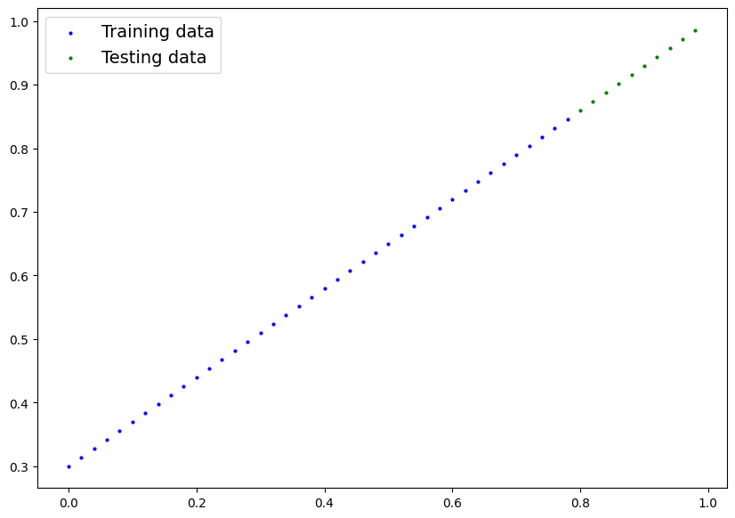
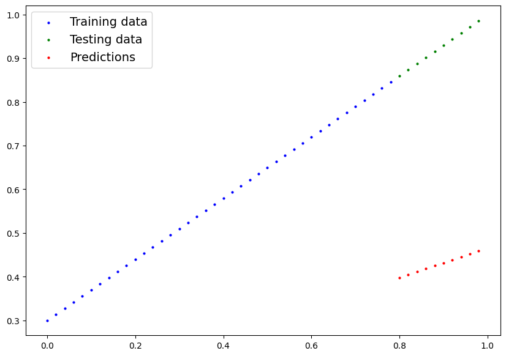
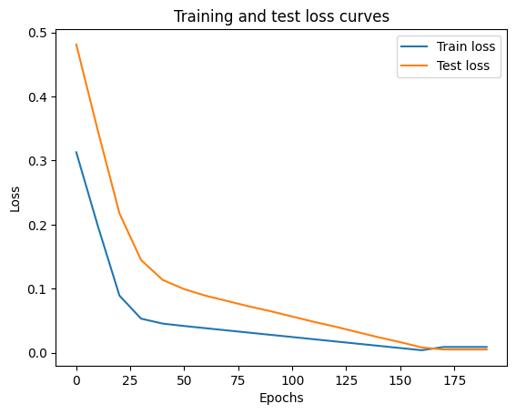
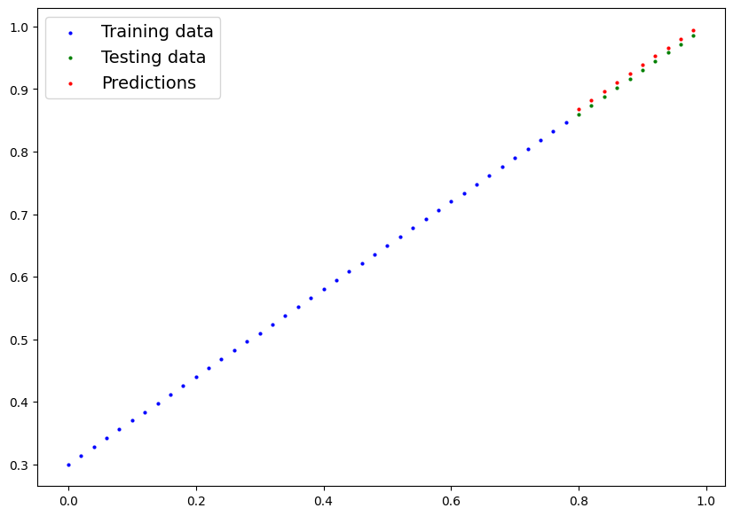
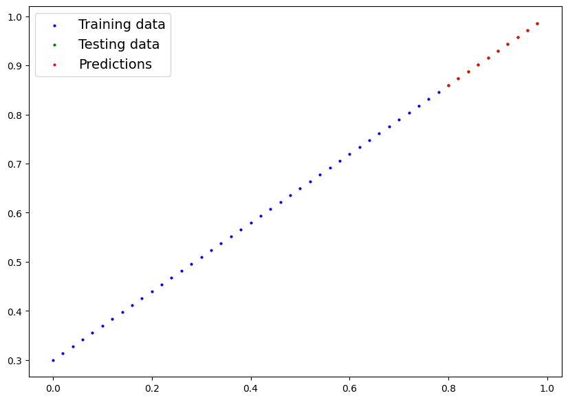

# PyTorch Workflow

Let's explore an example PyTorch end-to-end workflow.

Resources:
* Ground truth notebook - https://github.com/mrdbourke/pytorch-deep-learning/blob/main/01_pytorch_workflow.ipynb
* Book version of notebook - https://www.learnpytorch.io/01_pytorch_workflow/
* Ask a question - https://github.com/mrdbourke/pytorch-deep-learning/discussions


```python
what_were_covering = {1: "data (prepare and load)",
                      2: "build model",
                      3: "fitting the model to data (training)",
                      4: "making predictions and evaluating a model (inference)",
                      5: "saving and loading a model",
                      6: "putting it all together"}

what_were_covering
```


    {1: 'data (prepare and load)',
     2: 'build model',
     3: 'fitting the model to data (training)',
     4: 'making predictions and evaluating a model (inference)',
     5: 'saving and loading a model',
     6: 'putting it all together'}


```python
import torch
from torch import nn # nn contains all of PyTorch's building blocks for neural networks
import matplotlib.pyplot as plt

# Check PyTorch version
torch.__version__
```


    '2.5.1+cu121'


## 1. Data (preparing and loading)

Data can be almost anything... in Machine Learning.

* Excel spreadsheet
* Images of any kind
* Videos (YouTube has lots of data...)
* Audio like songs or podcasts
* DNA
* Text

ML is a game of two parts:
1. Get data into numerical representation.
2. Build a model to learn patterns in that numerical representation.

To showcase this, let's create some *known* data using the linear regression formula.

We'll use a linear regression formula to make a straight line with *known* **parameters**.


```python
# Create *known* parameters
weight = 0.7
bias = 0.3

# Create
start = 0
end = 1
step = 0.02
X = torch.arange(start, end, step).unsqueeze(dim=1) # unsqueeze adds extra dimension # input
y = weight * X + bias # linear regression formula # ideal output

X[:10], y[:10]
```


    (tensor([[0.0000],
             [0.0200],
             [0.0400],
             [0.0600],
             [0.0800],
             [0.1000],
             [0.1200],
             [0.1400],
             [0.1600],
             [0.1800]]),
     tensor([[0.3000],
             [0.3140],
             [0.3280],
             [0.3420],
             [0.3560],
             [0.3700],
             [0.3840],
             [0.3980],
             [0.4120],
             [0.4260]]))


```python
len(X), len(y)
```


    (50, 50)


### Splitting data into training and test sets (one of the most important concepts in ML in general)

Let's create a training and test set with our data.


```python
# Create a train/test split
train_split = int(0.8 * len(X))
X_train, y_train = X[:train_split], y[:train_split]
X_test, y_test = X[train_split:], y[train_split:]

len(X_train), len(y_train), len(X_test), len(y_test) # training features, training labels, testing features, testing labels
```


    (40, 40, 10, 10)


How might we better visualize our data?

This is where the data explorer's motto comes in!

"Visualize, visualize, visualize!"


```python
def plot_predictions(train_data=X_train,
                     train_labels=y_train,
                     test_data=X_test,
                     test_labels=y_test,
                     predictions=None):
  """
  Plots training data, test data and compares predictions.
  """
  plt.figure(figsize=(10, 7))

  # Plot training data in blue
  plt.scatter(train_data, train_labels, c="b", s=4, label="Training data") # s = size

  # Plot test data in green
  plt.scatter(test_data, test_labels, c="g", s=4, label="Testing data")

  # Are there predictions?
  if predictions is not None:
    # Plot the predictions if thex exist
    plt.scatter(test_data, predictions, c="r", s=4, label="Predictions") # train data and predict the y values of X_test, evaluate model how good predictions are with predictions vs. the values of the test data set

  # Show the legend
  plt.legend(prop={"size": 14});
```


```python
plot_predictions();
```


    

    


## 2. Build model

Our first PyTorch model!

Bc we're going to be building classes throughout the course, get familiar with OOP in Python. To do so, use the following resource from Real Python: https://realpython.com/python3-object-oriented-programming/

What our model does:
* Start with random value (weight & bias)
* Look at training data and adjust the random values to better represent (or get closer to) the ideal values (the weight & bias values we used to create the data)

How does it do so?

Through two main algorithms:
1. Gradient descent - https://www.youtube.com/watch?v=IHZwWFHWa-w
2. Backpropagation - https://www.youtube.com/watch?v=Ilg3gGewQ5U


```python
from torch import nn

# Create linear regression model class
class LinearRegressionModel(nn.Module): # almost everything in PyTorch inherites from nn.Module
  def __init__(self):
    super().__init__()
    self.weights = nn.Parameter(torch.randn(1,                  # start with a random weight and try to adjust it to the ideal weight
                                            requires_grad=True, # can this parameter be updated via gradient descent?
                                            dtype=torch.float)) # PyTorch loves the datatype torch.float32

    self.bias = nn.Parameter(torch.randn(1,                   # start with a random bias and try to adjust it to the ideal bias
                                         requires_grad=True,  # can this parameter be updated via gradient descent?
                                         dtype=torch.float))  # PyTorch loves the datatype torch.float32

  # Forward method to define the computation in the model
  def forward(self, x: torch.Tensor) -> torch.Tensor: # "x" is the input data
    return self.weights * x + self.bias # linear regression formula
```

### PyTorch model building essentials

* torch.nn - contains all of the building blocks for computational graphs (a neural network can be considered a computational graph)
* torch.nn.Parameter - what parameters should our model try and learn, often a PyTorch layer from torch.nn will set these for use
* torch.nn.Module - The base class for all neural network modules, if you subclass it, you should overwrite forward()
* torch.optim - this is where the optimizers in PyTorch live, they will help with gradient descent
* def forward() - All nn.Module subclasses require you to overwrite forward(), this method defines what happens in the forward computation

See more of the essential modules via the PyTorch cheatsheet - https://pytorch.org/tutorials/beginner/ptcheat.html

### Checking the contents of our PyTorch model

Now we've created a model, let's see what's inside...

So we can check our model parameters or what's inside our model using `.parameters()`.


```python
# Create a random seed
torch.manual_seed(42)

# Create an instance of the model (this is a subclass of nn.Module)
model_0 = LinearRegressionModel()

# Check out the parameters
list(model_0.parameters())
```


    [Parameter containing:
     tensor([0.3367], requires_grad=True),
     Parameter containing:
     tensor([0.1288], requires_grad=True)]


```python
# List named parameters
model_0.state_dict()
```


    OrderedDict([('weights', tensor([0.3367])), ('bias', tensor([0.1288]))])


```python
# The ideal values
weight, bias
```


    (0.7, 0.3)


### Making predictions using `torch.inference_mode()`

To check our model's predictive power, let's see how well it predicts `y_test` based on `X_test`.

When we pass data through our model, it's going to run it through the `forward()`method.


```python
y_preds = model_0(X_test)
y_preds
```


    tensor([[0.3982],
            [0.4049],
            [0.4116],
            [0.4184],
            [0.4251],
            [0.4318],
            [0.4386],
            [0.4453],
            [0.4520],
            [0.4588]], grad_fn=<AddBackward0>)


```python
# Make predictions with model
with torch.inference_mode(): # context manager, disables all things used for training as inference does not belong to training, that is why we don't keep track of the gradient for example
  y_preds = model_0(X_test)

# You can alsodo something similar with torch.no_grad(), however, torch.inference_mode() is preferred

y_preds
```


    tensor([[0.3982],
            [0.4049],
            [0.4116],
            [0.4184],
            [0.4251],
            [0.4318],
            [0.4386],
            [0.4453],
            [0.4520],
            [0.4588]])


See more on inference mode here - https://x.com/PyTorch/status/1437838231505096708?lang=de


```python
y_test
```


    tensor([[0.8600],
            [0.8740],
            [0.8880],
            [0.9020],
            [0.9160],
            [0.9300],
            [0.9440],
            [0.9580],
            [0.9720],
            [0.9860]])


```python
plot_predictions(predictions=y_preds)
```


    

    


## 3. Train model

The whole idea of training is for a model to move from some *unknown* parameters (these may be random) to some *known* parameters.

Or in other words from a poor representation to a better representation of the data.

One way to measure how poor or how wrong your model's predictions are is to use a loss function.

* Note: Loss function may also be called cost function or criterion in different areas. For our case, we're going to refer to it as a loss function.

Things we need to train:

* **Loss function:** A function to measure how wrong your model's predictions are to the ideal outputs, lower is better.
* **Optimizer:** Takes into account the loss of a model and adjusts the model's parameters (e.g. weight & bias in our case) to improve the loss function - https://pytorch.org/docs/stable/optim.html#

  * inside the optimizer you'll often have to set two parameters:
      * `params` - the model parameters you'd like to optimize, for example `params=model_0.parameters()`
      * `lr` (learning rate) - the learning rate is a hyperparameter that defines how big/small the optimizer changes the parameters with each step (a small `lr` results in small changes, a large `lr` results in large changes)

Specifically for PyTorch, we need:
* A training loop
* A testing loop


```python
list(model_0.parameters())
```


    [Parameter containing:
     tensor([0.3367], requires_grad=True),
     Parameter containing:
     tensor([0.1288], requires_grad=True)]


```python
# Check out our model's parameters (a parameter is a value that the model sets itself)
model_0.state_dict()
```


    OrderedDict([('weights', tensor([0.3367])), ('bias', tensor([0.1288]))])


```python
# Setup a loss function
loss_fn = nn.L1Loss() # nn.L1Loss() measures the mean absolute error (MAE) between each element in the input and target

# Setup an optimizer (stochastic gradient descent)
optimizer = torch.optim.SGD(params=model_0.parameters(),
                            lr=0.01) # lr = learning rate = possibly the most important hyperparameter you can set
```

**Q:** Which loss function and optimizer should I use?

**A:** This will be problem specific. But with experience, you'll get an idea of what works and what doesn't with your particular problem set.

For example, for a regression problem (like ours), a loss function of `nn.L1Loss()` and an optimizer like `torch.optim.SGD()` will suffice.

But for a classification problem like classifying whether a photo is of a dog or a cat, you'll likely want to use a loss function of `nn.BCELoss()` (binary cross entropy loss).

### Building a training loop (and a testing loop) in PyTorch

A couple of things we need in a training loop:
0. Loop through the data and do...
1. Forward pass (this involves data moving through our model's `forward()` functions) to make predictions on data - also called forward propagation
2. Calculate the loss (compare forward pass predictions to ground truth labels)
3. Optimizer zero grad
4. Loss backward - move backwards through the network to calculate the gradients of each of the parameters of our model with respect to the loss (**backpropagation** - https://www.youtube.com/watch?v=tIeHLnjs5U8)
5. Optimizer step - use the optimizer to adjust the model's parameters to try and improve the loss (**gradient descent** - https://www.youtube.com/watch?v=IHZwWFHWa-w)


```python
torch.manual_seed(42)

# An epoch is one loop through the data... (this is a hyperparameter bc we've set it ourselves)
epochs = 200

# Track different values
epoch_count = []
loss_values = []
test_loss_values = []

### Training
# 0. Loop through the data
for epoch in range(epochs):
  # Set the model to training mode
  model_0.train() # train mode in PyTorch sets all parameters that require gradients to require gradients

  # 1. Forward pass
  y_pred = model_0(X_train)

  # 2. Calculate the loss
  loss = loss_fn(y_pred, y_train)

  # 3. Optimizer zero grad
  optimizer.zero_grad()

  # 4. Perform backpropagation on the loss with respect to the parameters of the model
  loss.backward()

  # 5. Step the optimizer (perform gradient descent)
  optimizer.step() # by default how the optimizer changes will accumulate through the loop so... we have to zero them above in step 3 for the next iteration of the loop


  ### Testing
  model_0.eval() # turns off different settings in the model not needed for evaluating/testing (dropout/batch norm layers)
  with torch.inference_mode(): # this turns off gradient tracking & a couple more things behind the scenes # you may also see torch.no_grad() in older PyTorch code
    # 1. Do the forward pass
    test_pred = model_0(X_test)

    # 2. Calculate the loss
    test_loss = loss_fn(test_pred, y_test)

  # Print out what's happening
  if epoch % 10 == 0:
    epoch_count.append(epoch)
    loss_values.append(loss)
    test_loss_values.append(test_loss)
    print(f"Epoch: {epoch} | Loss: {loss} | Test loss: {test_loss}")
    # Print out model state_dict()
    print(model_0.state_dict())
```

    Epoch: 0 | Loss: 0.31288138031959534 | Test loss: 0.48106518387794495
    OrderedDict([('weights', tensor([0.3406])), ('bias', tensor([0.1388]))])
    Epoch: 10 | Loss: 0.1976713240146637 | Test loss: 0.3463551998138428
    OrderedDict([('weights', tensor([0.3796])), ('bias', tensor([0.2388]))])
    Epoch: 20 | Loss: 0.08908725529909134 | Test loss: 0.21729660034179688
    OrderedDict([('weights', tensor([0.4184])), ('bias', tensor([0.3333]))])
    Epoch: 30 | Loss: 0.053148526698350906 | Test loss: 0.14464017748832703
    OrderedDict([('weights', tensor([0.4512])), ('bias', tensor([0.3768]))])
    Epoch: 40 | Loss: 0.04543796554207802 | Test loss: 0.11360953003168106
    OrderedDict([('weights', tensor([0.4748])), ('bias', tensor([0.3868]))])
    Epoch: 50 | Loss: 0.04167863354086876 | Test loss: 0.09919948130846024
    OrderedDict([('weights', tensor([0.4938])), ('bias', tensor([0.3843]))])
    Epoch: 60 | Loss: 0.03818932920694351 | Test loss: 0.08886633068323135
    OrderedDict([('weights', tensor([0.5116])), ('bias', tensor([0.3788]))])
    Epoch: 70 | Loss: 0.03476089984178543 | Test loss: 0.0805937647819519
    OrderedDict([('weights', tensor([0.5288])), ('bias', tensor([0.3718]))])
    Epoch: 80 | Loss: 0.03132382780313492 | Test loss: 0.07232122868299484
    OrderedDict([('weights', tensor([0.5459])), ('bias', tensor([0.3648]))])
    Epoch: 90 | Loss: 0.02788739837706089 | Test loss: 0.06473556160926819
    OrderedDict([('weights', tensor([0.5629])), ('bias', tensor([0.3573]))])
    Epoch: 100 | Loss: 0.024458957836031914 | Test loss: 0.05646304413676262
    OrderedDict([('weights', tensor([0.5800])), ('bias', tensor([0.3503]))])
    Epoch: 110 | Loss: 0.021020207554101944 | Test loss: 0.04819049686193466
    OrderedDict([('weights', tensor([0.5972])), ('bias', tensor([0.3433]))])
    Epoch: 120 | Loss: 0.01758546568453312 | Test loss: 0.04060482233762741
    OrderedDict([('weights', tensor([0.6141])), ('bias', tensor([0.3358]))])
    Epoch: 130 | Loss: 0.014155393466353416 | Test loss: 0.03233227878808975
    OrderedDict([('weights', tensor([0.6313])), ('bias', tensor([0.3288]))])
    Epoch: 140 | Loss: 0.010716589167714119 | Test loss: 0.024059748277068138
    OrderedDict([('weights', tensor([0.6485])), ('bias', tensor([0.3218]))])
    Epoch: 150 | Loss: 0.0072835334576666355 | Test loss: 0.016474086791276932
    OrderedDict([('weights', tensor([0.6654])), ('bias', tensor([0.3143]))])
    Epoch: 160 | Loss: 0.0038517764769494534 | Test loss: 0.008201557211577892
    OrderedDict([('weights', tensor([0.6826])), ('bias', tensor([0.3073]))])
    Epoch: 170 | Loss: 0.008932482451200485 | Test loss: 0.005023092031478882
    OrderedDict([('weights', tensor([0.6951])), ('bias', tensor([0.2993]))])
    Epoch: 180 | Loss: 0.008932482451200485 | Test loss: 0.005023092031478882
    OrderedDict([('weights', tensor([0.6951])), ('bias', tensor([0.2993]))])
    Epoch: 190 | Loss: 0.008932482451200485 | Test loss: 0.005023092031478882
    OrderedDict([('weights', tensor([0.6951])), ('bias', tensor([0.2993]))])


```python
import numpy as np
test_loss_values
```


    [tensor(0.4811),
     tensor(0.3464),
     tensor(0.2173),
     tensor(0.1446),
     tensor(0.1136),
     tensor(0.0992),
     tensor(0.0889),
     tensor(0.0806),
     tensor(0.0723),
     tensor(0.0647),
     tensor(0.0565),
     tensor(0.0482),
     tensor(0.0406),
     tensor(0.0323),
     tensor(0.0241),
     tensor(0.0165),
     tensor(0.0082),
     tensor(0.0050),
     tensor(0.0050),
     tensor(0.0050)]


```python
# Plot the loss curves
plt.plot(epoch_count, np.array(torch.tensor(loss_values).numpy()), label="Train loss")
plt.plot(epoch_count, test_loss_values, label="Test loss")
plt.title("Training and test loss curves")
plt.ylabel("Loss")
plt.xlabel("Epochs")
plt.legend();
```


    

    


```python
with torch.inference_mode():
  y_preds_new = model_0(X_test)
```


```python
model_0.state_dict()
```


    OrderedDict([('weights', tensor([0.6990])), ('bias', tensor([0.3093]))])


```python
weight, bias
```


    (0.7, 0.3)


```python
plot_predictions(predictions=y_preds);
```


    

    


```python
plot_predictions(predictions=y_preds_new);
```


    

    


## Saving a model in PyTorch

There are three main methods you should know about for saving and loading models in PyTorch.

1. `torch.save()` - allows you to save a PyTorch object in Python's pickle format
2. `torch.load()` - allows you to load a saved PyTorch object
3. `torch.nn.Module.load_state_dict()` - this allows you to load a model's saved state dictionary

PyTorch save & load code tutorial + extra-curriculum - https://pytorch.org/tutorials/beginner/saving_loading_models.html#saving-loading-model-for-inference


```python
# Saving our PyTorch model
from pathlib import Path

# 1. Create models directory
MODEL_PATH = Path("models")
MODEL_PATH.mkdir(parents=True, exist_ok=True)

# 2. Create model save path
MODEL_NAME = "01_pytorch_workflow_model_0.pth" # can also use .pt
MODEL_SAVE_PATH = MODEL_PATH / MODEL_NAME

# 3. Save the model state dict
print(f"Saving model to: {MODEL_SAVE_PATH}")
torch.save(obj=model_0.state_dict(),
           f=MODEL_SAVE_PATH)
```

    Saving model to: models/01_pytorch_workflow_model_0.pth


```python
!ls -l models
```

    total 4
    -rw-r--r-- 1 root root 1680 Dec 20 22:41 01_pytorch_workflow_model_0.pth


## Loading a PyTorch model

Since we saved our model's `state_dict()` rather than the entire model, we'll create a new instance of our model class and load the saved `state_dict()` into that.


```python
model_0.state_dict()
```


    OrderedDict([('weights', tensor([0.6990])), ('bias', tensor([0.3093]))])


```python
# To load in a saved state_dict we have to instantiate a new instance of our model class
loaded_model_0 = LinearRegressionModel()

# Load the saved state_dict of model_0 (this will update the new instance with updated parameters)
loaded_model_0.load_state_dict(torch.load(f=MODEL_SAVE_PATH))
```

    <ipython-input-30-ade34efd9648>:5: FutureWarning: You are using `torch.load` with `weights_only=False` (the current default value), which uses the default pickle module implicitly. It is possible to construct malicious pickle data which will execute arbitrary code during unpickling (See https://github.com/pytorch/pytorch/blob/main/SECURITY.md#untrusted-models for more details). In a future release, the default value for `weights_only` will be flipped to `True`. This limits the functions that could be executed during unpickling. Arbitrary objects will no longer be allowed to be loaded via this mode unless they are explicitly allowlisted by the user via `torch.serialization.add_safe_globals`. We recommend you start setting `weights_only=True` for any use case where you don't have full control of the loaded file. Please open an issue on GitHub for any issues related to this experimental feature.
      loaded_model_0.load_state_dict(torch.load(f=MODEL_SAVE_PATH))


    <All keys matched successfully>


```python
loaded_model_0.state_dict()
```


    OrderedDict([('weights', tensor([0.6990])), ('bias', tensor([0.3093]))])


```python
# Make some predictions with our loaded model
loaded_model_0.eval()
with torch.inference_mode():
  loaded_model_preds = loaded_model_0(X_test)

loaded_model_preds
```


    tensor([[0.8685],
            [0.8825],
            [0.8965],
            [0.9105],
            [0.9245],
            [0.9384],
            [0.9524],
            [0.9664],
            [0.9804],
            [0.9944]])


```python
# Make some models preds
model_0.eval()
with torch.inference_mode():
  y_preds = model_0(X_test)

y_preds
```


    tensor([[0.8685],
            [0.8825],
            [0.8965],
            [0.9105],
            [0.9245],
            [0.9384],
            [0.9524],
            [0.9664],
            [0.9804],
            [0.9944]])


```python
# Compare loaded model preds with original model preds
y_preds == loaded_model_preds
```


    tensor([[True],
            [True],
            [True],
            [True],
            [True],
            [True],
            [True],
            [True],
            [True],
            [True]])


## 6. Putting it all together

Let's go back through the steps above and see it all in one place.


```python
# Import PyTorch and matplotlib
import torch
from torch import nn
import matplotlib.pyplot as plt

# Check PyTorch version
torch.__version__
```


    '2.5.1+cu121'


Create device-agnostic code.

This means if we've got access to a GPU, our code will use it (for potential faster computing).

If no GPU is available, the code will default to using CPU.


```python
# Setup device agnostc code
device = "cuda" if torch.cuda.is_available() else "cpu"
print(f"Using device: {device}")
```

    Using device: cuda


### 6.1 Data


```python
# Create some data using the linear regression formula of y = weight * X + bias
weight = 0.7
bias = 0.3

# Create range values
start = 0
end = 1
step = 0.02

# Create X ans y (features and labels)
X = torch.arange(start, end, step).unsqueeze(dim=1) # without unsqueeze, errors will pop up
y = weight * X + bias
X[:10], y[:10]
```


    (tensor([[0.0000],
             [0.0200],
             [0.0400],
             [0.0600],
             [0.0800],
             [0.1000],
             [0.1200],
             [0.1400],
             [0.1600],
             [0.1800]]),
     tensor([[0.3000],
             [0.3140],
             [0.3280],
             [0.3420],
             [0.3560],
             [0.3700],
             [0.3840],
             [0.3980],
             [0.4120],
             [0.4260]]))


```python
# Split data
train_split = int(0.8 * len(X))
X_train, y_train = X[:train_split], y[:train_split]
X_test, y_test = X[train_split:], y[train_split:]
len(X_train), len(y_train), len(X_test), len(y_test)
```


    (40, 40, 10, 10)


```python
# Plot the data
# Note: if you don't have the plot_predictions() function loaded, this will error
plot_predictions(X_train, y_train, X_test, y_test)
```


    

    


### 6.2 Building a PyTorch Linear model


```python
# Create a linear model by subclassing nn.Module
class LinearRegressionModelV2(nn.Module):
  def __init__(self):
    super().__init__()
    # Use nn.Linear() for creating the model parameters / also called: linear transform, probing layer, fully connected layer, dense layer
    self.linear_layer = nn.Linear(in_features=1,
                                  out_features=1)

  def forward(self, x: torch.Tensor) -> torch.Tensor:
    return self.linear_layer(x)

# Set the manual seed
torch.manual_seed(42)
model_1 = LinearRegressionModelV2()
model_1, model_1.state_dict()
```


    (LinearRegressionModelV2(
       (linear_layer): Linear(in_features=1, out_features=1, bias=True)
     ),
     OrderedDict([('linear_layer.weight', tensor([[0.7645]])),
                  ('linear_layer.bias', tensor([0.8300]))]))


```python
# Check the model current device
next(model_1.parameters()).device
```


    device(type='cpu')


```python
# Set the model to use the target device
model_1.to(device)
next(model_1.parameters()).device
```


    device(type='cuda', index=0)


### 6.3 Training

For training we need:
* Loss function
* Optimizer
* Training loop
* Testing loop


```python
# Setup loss function
loss_fn = nn.L1Loss() # same as MAE

# Setup out optimizer
optimizer = torch.optim.SGD(params=model_1.parameters(),
                            lr=0.01)
```


```python
# Let's write a training loop
torch.manual_seed(42)

epochs = 200

# Put data on the target device (device agnostic code for data)
X_train = X_train.to(device)
y_train = y_train.to(device)
X_test = X_test.to(device)
y_test = y_test.to(device)

for epoch in range(epochs):
  model_1.train()

  # 1. Forward pass
  y_pred = model_1(X_train)

  # 2. Calculate the loss
  loss = loss_fn(y_pred, y_train)

  # 3. Optimizer zero grad
  optimizer.zero_grad()

  # 4. Perform backpropagation
  loss.backward()

  # 5. Optimizer step
  optimizer.step()

  ### Testing
  model_1.eval()
  with torch.inference_mode():
    test_pred = model_1(X_test)

    test_loss = loss_fn(test_pred, y_test)

  # Print out what's happening

  if epoch % 10 == 0:
    print(f"Epoch: {epoch} | Loss: {loss} | Test loss: {test_loss}")
```

    Epoch: 0 | Loss: 0.5551779866218567 | Test loss: 0.5739762187004089
    Epoch: 10 | Loss: 0.439968079328537 | Test loss: 0.4392664134502411
    Epoch: 20 | Loss: 0.3247582018375397 | Test loss: 0.30455657839775085
    Epoch: 30 | Loss: 0.20954833924770355 | Test loss: 0.16984669864177704
    Epoch: 40 | Loss: 0.09433845430612564 | Test loss: 0.03513690456748009
    Epoch: 50 | Loss: 0.023886388167738914 | Test loss: 0.04784907028079033
    Epoch: 60 | Loss: 0.019956795498728752 | Test loss: 0.045803118497133255
    Epoch: 70 | Loss: 0.016517987474799156 | Test loss: 0.037530567497015
    Epoch: 80 | Loss: 0.013089174404740334 | Test loss: 0.02994490973651409
    Epoch: 90 | Loss: 0.009653178043663502 | Test loss: 0.02167237363755703
    Epoch: 100 | Loss: 0.006215683650225401 | Test loss: 0.014086711220443249
    Epoch: 110 | Loss: 0.00278724217787385 | Test loss: 0.005814164876937866
    Epoch: 120 | Loss: 0.0012645035749301314 | Test loss: 0.013801801018416882
    Epoch: 130 | Loss: 0.0012645035749301314 | Test loss: 0.013801801018416882
    Epoch: 140 | Loss: 0.0012645035749301314 | Test loss: 0.013801801018416882
    Epoch: 150 | Loss: 0.0012645035749301314 | Test loss: 0.013801801018416882
    Epoch: 160 | Loss: 0.0012645035749301314 | Test loss: 0.013801801018416882
    Epoch: 170 | Loss: 0.0012645035749301314 | Test loss: 0.013801801018416882
    Epoch: 180 | Loss: 0.0012645035749301314 | Test loss: 0.013801801018416882
    Epoch: 190 | Loss: 0.0012645035749301314 | Test loss: 0.013801801018416882


```python
model_1.state_dict()
```


    OrderedDict([('linear_layer.weight', tensor([[0.6968]], device='cuda:0')),
                 ('linear_layer.bias', tensor([0.3025], device='cuda:0'))])


```python
weight, bias # in practice we don't know these ideal parameters
```


    (0.7, 0.3)


### 6.4 Making and evaluating predictions


```python
# Turn model into evaluation mode
model_1.eval()

# Make predictions on the test data
with torch.inference_mode():
  y_preds = model_1(X_test)
y_preds
```


    tensor([[0.8600],
            [0.8739],
            [0.8878],
            [0.9018],
            [0.9157],
            [0.9296],
            [0.9436],
            [0.9575],
            [0.9714],
            [0.9854]], device='cuda:0')


```python
# Check out our model predictions visually
plot_predictions(predictions=y_preds.cpu())
```


    

    


### 6.5 Saving & Loading a trained model


```python
from pathlib import Path

# 1. Create models directory
MODEL_PATH = Path("models")
MODEL_PATH.mkdir(parents=True, exist_ok=True)

# 2. Create model save path
MODEL_NAME = "01_pytorch_workflow_model_1.pth"
MODEL_SAVE_PATH = MODEL_PATH / MODEL_NAME

# 3. Save the model state dict
print(f"Saving model to: {MODEL_SAVE_PATH}")
torch.save(obj=model_1.state_dict(),
           f=MODEL_SAVE_PATH)
```

    Saving model to: models/01_pytorch_workflow_model_1.pth


```python
model_1.state_dict()
```


    OrderedDict([('linear_layer.weight', tensor([[0.6968]], device='cuda:0')),
                 ('linear_layer.bias', tensor([0.3025], device='cuda:0'))])


```python
# Load a PyTorch model

# Create a new instance of linear regression model V2
loaded_model_1 = LinearRegressionModelV2()

# Load the saved model_1 state_dict
loaded_model_1.load_state_dict(torch.load(MODEL_SAVE_PATH))

# Put the loaded model to device
loaded_model_1.to(device)
```

    <ipython-input-53-4388fb3fd5b8>:7: FutureWarning: You are using `torch.load` with `weights_only=False` (the current default value), which uses the default pickle module implicitly. It is possible to construct malicious pickle data which will execute arbitrary code during unpickling (See https://github.com/pytorch/pytorch/blob/main/SECURITY.md#untrusted-models for more details). In a future release, the default value for `weights_only` will be flipped to `True`. This limits the functions that could be executed during unpickling. Arbitrary objects will no longer be allowed to be loaded via this mode unless they are explicitly allowlisted by the user via `torch.serialization.add_safe_globals`. We recommend you start setting `weights_only=True` for any use case where you don't have full control of the loaded file. Please open an issue on GitHub for any issues related to this experimental feature.
      loaded_model_1.load_state_dict(torch.load(MODEL_SAVE_PATH))


    LinearRegressionModelV2(
      (linear_layer): Linear(in_features=1, out_features=1, bias=True)
    )


```python
next(loaded_model_1.parameters()).device
```


    device(type='cuda', index=0)


```python
loaded_model_1.state_dict()
```


    OrderedDict([('linear_layer.weight', tensor([[0.6968]], device='cuda:0')),
                 ('linear_layer.bias', tensor([0.3025], device='cuda:0'))])


```python
# Evaluate loaded model
loaded_model_1.eval()
with torch.inference_mode():
  loaded_model_1_preds = loaded_model_1(X_test)
y_preds == loaded_model_1_preds
```


    tensor([[True],
            [True],
            [True],
            [True],
            [True],
            [True],
            [True],
            [True],
            [True],
            [True]], device='cuda:0')


```python

```
