# 02. Neural Network classification with PyTorch

Classification is a problem of predicting whether something is one thing or another (there can be multiple things as the options).

Book version of this notebook - https://www.learnpytorch.io/02_pytorch_classification/
All other resources - https://github.com/mrdbourke/pytorch-deep-learning
Ask questions here - https://github.com/mrdbourke/pytorch-deep-learning/discussions

## 1. Make classification data and get ready


```python
import sklearn
```


```python
from sklearn.datasets import make_circles

# Make 1000 samples
n_samples = 1000

# Create circles
X, y = make_circles(n_samples,
                    noise=0.03,
                    random_state=42)
```


```python
len(X), len(y)
```


    (1000, 1000)


```python
print(f"First 5 samples of X:\n {X[:5]}")
print(f"First 5 samples of y:\n {y[:5]}")
```

    First 5 samples of X:
     [[ 0.75424625  0.23148074]
     [-0.75615888  0.15325888]
     [-0.81539193  0.17328203]
     [-0.39373073  0.69288277]
     [ 0.44220765 -0.89672343]]
    First 5 samples of y:
     [1 1 1 1 0]


```python
# Make DataFrame of circle data
import pandas as pd
circles = pd.DataFrame({"X1": X[:, 0],
                        "X2": X[:, 1],
                        "label": y})
circles.head(10)
```


  <div id="df-72327be7-4c36-443f-8fb7-61cb1f3c1172" class="colab-df-container">
    <div>
<style scoped>
    .dataframe tbody tr th:only-of-type {
        vertical-align: middle;
    }

    .dataframe tbody tr th {
        vertical-align: top;
    }

    .dataframe thead th {
        text-align: right;
    }
</style>
<table border="1" class="dataframe">
  <thead>
    <tr style="text-align: right;">
      <th></th>
      <th>X1</th>
      <th>X2</th>
      <th>label</th>
    </tr>
  </thead>
  <tbody>
    <tr>
      <th>0</th>
      <td>0.754246</td>
      <td>0.231481</td>
      <td>1</td>
    </tr>
    <tr>
      <th>1</th>
      <td>-0.756159</td>
      <td>0.153259</td>
      <td>1</td>
    </tr>
    <tr>
      <th>2</th>
      <td>-0.815392</td>
      <td>0.173282</td>
      <td>1</td>
    </tr>
    <tr>
      <th>3</th>
      <td>-0.393731</td>
      <td>0.692883</td>
      <td>1</td>
    </tr>
    <tr>
      <th>4</th>
      <td>0.442208</td>
      <td>-0.896723</td>
      <td>0</td>
    </tr>
    <tr>
      <th>5</th>
      <td>-0.479646</td>
      <td>0.676435</td>
      <td>1</td>
    </tr>
    <tr>
      <th>6</th>
      <td>-0.013648</td>
      <td>0.803349</td>
      <td>1</td>
    </tr>
    <tr>
      <th>7</th>
      <td>0.771513</td>
      <td>0.147760</td>
      <td>1</td>
    </tr>
    <tr>
      <th>8</th>
      <td>-0.169322</td>
      <td>-0.793456</td>
      <td>1</td>
    </tr>
    <tr>
      <th>9</th>
      <td>-0.121486</td>
      <td>1.021509</td>
      <td>0</td>
    </tr>
  </tbody>
</table>
</div>
    <div class="colab-df-buttons">

  <div class="colab-df-container">
    <button class="colab-df-convert" onclick="convertToInteractive('df-72327be7-4c36-443f-8fb7-61cb1f3c1172')"
            title="Convert this dataframe to an interactive table."
            style="display:none;">

  <svg xmlns="http://www.w3.org/2000/svg" height="24px" viewBox="0 -960 960 960">
    <path d="M120-120v-720h720v720H120Zm60-500h600v-160H180v160Zm220 220h160v-160H400v160Zm0 220h160v-160H400v160ZM180-400h160v-160H180v160Zm440 0h160v-160H620v160ZM180-180h160v-160H180v160Zm440 0h160v-160H620v160Z"/>
  </svg>
    </button>

  <style>
    .colab-df-container {
      display:flex;
      gap: 12px;
    }

    .colab-df-convert {
      background-color: #E8F0FE;
      border: none;
      border-radius: 50%;
      cursor: pointer;
      display: none;
      fill: #1967D2;
      height: 32px;
      padding: 0 0 0 0;
      width: 32px;
    }

    .colab-df-convert:hover {
      background-color: #E2EBFA;
      box-shadow: 0px 1px 2px rgba(60, 64, 67, 0.3), 0px 1px 3px 1px rgba(60, 64, 67, 0.15);
      fill: #174EA6;
    }

    .colab-df-buttons div {
      margin-bottom: 4px;
    }

    [theme=dark] .colab-df-convert {
      background-color: #3B4455;
      fill: #D2E3FC;
    }

    [theme=dark] .colab-df-convert:hover {
      background-color: #434B5C;
      box-shadow: 0px 1px 3px 1px rgba(0, 0, 0, 0.15);
      filter: drop-shadow(0px 1px 2px rgba(0, 0, 0, 0.3));
      fill: #FFFFFF;
    }
  </style>

    <script>
      const buttonEl =
        document.querySelector('#df-72327be7-4c36-443f-8fb7-61cb1f3c1172 button.colab-df-convert');
      buttonEl.style.display =
        google.colab.kernel.accessAllowed ? 'block' : 'none';

      async function convertToInteractive(key) {
        const element = document.querySelector('#df-72327be7-4c36-443f-8fb7-61cb1f3c1172');
        const dataTable =
          await google.colab.kernel.invokeFunction('convertToInteractive',
                                                    [key], {});
        if (!dataTable) return;

        const docLinkHtml = 'Like what you see? Visit the ' +
          '<a target="_blank" href=https://colab.research.google.com/notebooks/data_table.ipynb>data table notebook</a>'
          + ' to learn more about interactive tables.';
        element.innerHTML = '';
        dataTable['output_type'] = 'display_data';
        await google.colab.output.renderOutput(dataTable, element);
        const docLink = document.createElement('div');
        docLink.innerHTML = docLinkHtml;
        element.appendChild(docLink);
      }
    </script>
  </div>


<div id="df-552c057f-e0d5-403e-9844-f941f4a077d9">
  <button class="colab-df-quickchart" onclick="quickchart('df-552c057f-e0d5-403e-9844-f941f4a077d9')"
            title="Suggest charts"
            style="display:none;">

<svg xmlns="http://www.w3.org/2000/svg" height="24px"viewBox="0 0 24 24"
     width="24px">
    <g>
        <path d="M19 3H5c-1.1 0-2 .9-2 2v14c0 1.1.9 2 2 2h14c1.1 0 2-.9 2-2V5c0-1.1-.9-2-2-2zM9 17H7v-7h2v7zm4 0h-2V7h2v10zm4 0h-2v-4h2v4z"/>
    </g>
</svg>
  </button>

<style>
  .colab-df-quickchart {
      --bg-color: #E8F0FE;
      --fill-color: #1967D2;
      --hover-bg-color: #E2EBFA;
      --hover-fill-color: #174EA6;
      --disabled-fill-color: #AAA;
      --disabled-bg-color: #DDD;
  }

  [theme=dark] .colab-df-quickchart {
      --bg-color: #3B4455;
      --fill-color: #D2E3FC;
      --hover-bg-color: #434B5C;
      --hover-fill-color: #FFFFFF;
      --disabled-bg-color: #3B4455;
      --disabled-fill-color: #666;
  }

  .colab-df-quickchart {
    background-color: var(--bg-color);
    border: none;
    border-radius: 50%;
    cursor: pointer;
    display: none;
    fill: var(--fill-color);
    height: 32px;
    padding: 0;
    width: 32px;
  }

  .colab-df-quickchart:hover {
    background-color: var(--hover-bg-color);
    box-shadow: 0 1px 2px rgba(60, 64, 67, 0.3), 0 1px 3px 1px rgba(60, 64, 67, 0.15);
    fill: var(--button-hover-fill-color);
  }

  .colab-df-quickchart-complete:disabled,
  .colab-df-quickchart-complete:disabled:hover {
    background-color: var(--disabled-bg-color);
    fill: var(--disabled-fill-color);
    box-shadow: none;
  }

  .colab-df-spinner {
    border: 2px solid var(--fill-color);
    border-color: transparent;
    border-bottom-color: var(--fill-color);
    animation:
      spin 1s steps(1) infinite;
  }

  @keyframes spin {
    0% {
      border-color: transparent;
      border-bottom-color: var(--fill-color);
      border-left-color: var(--fill-color);
    }
    20% {
      border-color: transparent;
      border-left-color: var(--fill-color);
      border-top-color: var(--fill-color);
    }
    30% {
      border-color: transparent;
      border-left-color: var(--fill-color);
      border-top-color: var(--fill-color);
      border-right-color: var(--fill-color);
    }
    40% {
      border-color: transparent;
      border-right-color: var(--fill-color);
      border-top-color: var(--fill-color);
    }
    60% {
      border-color: transparent;
      border-right-color: var(--fill-color);
    }
    80% {
      border-color: transparent;
      border-right-color: var(--fill-color);
      border-bottom-color: var(--fill-color);
    }
    90% {
      border-color: transparent;
      border-bottom-color: var(--fill-color);
    }
  }
</style>

  <script>
    async function quickchart(key) {
      const quickchartButtonEl =
        document.querySelector('#' + key + ' button');
      quickchartButtonEl.disabled = true;  // To prevent multiple clicks.
      quickchartButtonEl.classList.add('colab-df-spinner');
      try {
        const charts = await google.colab.kernel.invokeFunction(
            'suggestCharts', [key], {});
      } catch (error) {
        console.error('Error during call to suggestCharts:', error);
      }
      quickchartButtonEl.classList.remove('colab-df-spinner');
      quickchartButtonEl.classList.add('colab-df-quickchart-complete');
    }
    (() => {
      let quickchartButtonEl =
        document.querySelector('#df-552c057f-e0d5-403e-9844-f941f4a077d9 button');
      quickchartButtonEl.style.display =
        google.colab.kernel.accessAllowed ? 'block' : 'none';
    })();
  </script>
</div>

    </div>
  </div>


```python
circles.label.value_counts()
```


<div>
<style scoped>
    .dataframe tbody tr th:only-of-type {
        vertical-align: middle;
    }

    .dataframe tbody tr th {
        vertical-align: top;
    }

    .dataframe thead th {
        text-align: right;
    }
</style>
<table border="1" class="dataframe">
  <thead>
    <tr style="text-align: right;">
      <th></th>
      <th>count</th>
    </tr>
    <tr>
      <th>label</th>
      <th></th>
    </tr>
  </thead>
  <tbody>
    <tr>
      <th>1</th>
      <td>500</td>
    </tr>
    <tr>
      <th>0</th>
      <td>500</td>
    </tr>
  </tbody>
</table>
</div><br><label><b>dtype:</b> int64</label>


```python
# Visualize, visualize, visualize
import matplotlib.pyplot as plt
plt.scatter(x=X[:, 0],
            y=X[:, 1],
            c=y,
            cmap=plt.cm.RdYlBu);
```


    
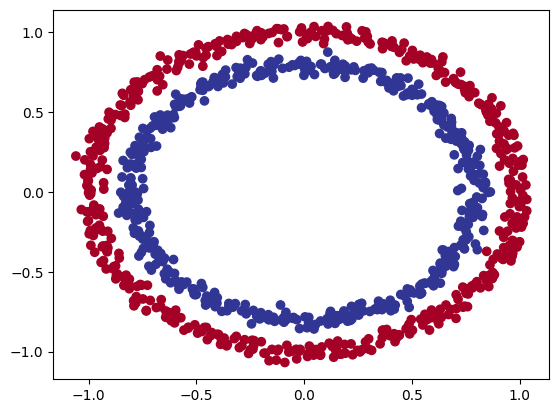
    


Note: The data we're working with is often referred to as a toy dataset, a dataset that is small enough to experiment but still sizeable enough to practice the fundamentals.

### 1.1 Check input and output shapes


```python
X.shape, y.shape
```


    ((1000, 2), (1000,))


```python
X
```


    array([[ 0.75424625,  0.23148074],
           [-0.75615888,  0.15325888],
           [-0.81539193,  0.17328203],
           ...,
           [-0.13690036, -0.81001183],
           [ 0.67036156, -0.76750154],
           [ 0.28105665,  0.96382443]])


```python
# View the first example of features and labels
X_sample = X[0]
y_sample = y[0]

print(f"Values for one sample of X: {X_sample} and the same for y: {y_sample}")
print(f"Shapes for one sample of X: {X_sample.shape} and the same for y: {y_sample.shape}")
# Scalars do not have shapes
```

    Values for one sample of X: [0.75424625 0.23148074] and the same for y: 1
    Shapes for one sample of X: (2,) and the same for y: ()


### 1.2 Turn data into tensors and create train and test splits


```python
import torch
torch.__version__
```


    '2.5.1+cu121'


```python
type(X), X.dtype
```


    (numpy.ndarray, dtype('float64'))


```python
# Turn data into tensors
X = torch.from_numpy(X).type(torch.float) # change datatype to float32 (pytorch default)
y = torch.from_numpy(y).type(torch.float)

X[:5], y[:5]
```


    (tensor([[ 0.7542,  0.2315],
             [-0.7562,  0.1533],
             [-0.8154,  0.1733],
             [-0.3937,  0.6929],
             [ 0.4422, -0.8967]]),
     tensor([1., 1., 1., 1., 0.]))


```python
type(X), X.dtype, y.dtype
```


    (torch.Tensor, torch.float32, torch.float32)


```python
# Split data into training and test sets
from sklearn.model_selection import train_test_split

X_train, X_test, y_train, y_test = train_test_split(X,
                                                    y,
                                                    test_size=0.2, # 0.2 = 20% of data will be test & 80% wil be train
                                                    random_state=42)
```


```python
len(X_train), len(X_test), len(y_train), len(y_test)
```


    (800, 200, 800, 200)


## 2. Building a model

Let's build a model to classify our blue and red dots.

To do so, we want to:
1. Setup device agnostic code so our code will run on an accelerator (GPU) if there is one
2. Construct a model (by subclassing `nn.Module`)
3. Define a loss function and optimizer
4. Create a training and test loop


```python
# Import PyTorch and nn
import torch
from torch import nn

# Make device agnostic code
device = "cuda" if torch.cuda.is_available() else "cpu"
device
```


    'cuda'


```python
X_train
```


    tensor([[ 0.6579, -0.4651],
            [ 0.6319, -0.7347],
            [-1.0086, -0.1240],
            ...,
            [ 0.0157, -1.0300],
            [ 1.0110,  0.1680],
            [ 0.5578, -0.5709]])


Now we've setup device agnostic code, let's create a model that:

1. Subclasses `nn.Module` (almost all models in PyTorch subclass `nn.Module`)
2. Create 2 `nn.Linear()` layers that are capable of handling the shapes of our data
3. Defines a `forward()` method that outlines the forward pass (or forward computation) of the model
4. Instantiate an instance of our model class and send it to the target `device`


```python
X_train.shape
```


    torch.Size([800, 2])


```python
y_train[:5]
```


    tensor([1., 0., 0., 0., 1.])


```python
from sklearn import datasets
# 1. Construct a model that subclasses nn.Module
class CircleModelV0(nn.Module):
  def __init__(self):
    super().__init__()
    # 2. Create 2 nn.Linear layers capable of handling the shapes of our data
    self.layer_1 = nn.Linear(in_features=2, out_features=5) # takes in 2 features and upscales to 5 features
    self.layer_2 = nn.Linear(in_features=5, out_features=1) # takes in 5 features from previous layer and outputs a single feature (same shape as y)

    #self.two_linear_layers = nn.Sequential(
    #    nn.Linear(in_features=2, out_features=5),
    #    nn.Linear(in_features=5, out_features=1)
    #)

  # 3. Definde a forward() method that outlines the forward pass
  def forward(self, x):
    return self.layer_2(self.layer_1(x)) # x -> layer 1 -> layer 2 -> output
    #return two_linear_layers(x)

# 4. Instantiate an instance of our model class and send it to the target device
model_0 = CircleModelV0().to(device)
model_0
```


    CircleModelV0(
      (layer_1): Linear(in_features=2, out_features=5, bias=True)
      (layer_2): Linear(in_features=5, out_features=1, bias=True)
    )


```python
device
```


    'cuda'


```python
next(model_0.parameters()).device
```


    device(type='cuda', index=0)


```python
# Let's replicate the model above using nn.Sequential(), same as commented code above
model_0 = nn.Sequential(
    nn.Linear(in_features=2, out_features=5),
    nn.Linear(in_features=5, out_features=1)
).to(device)

model_0
```


    Sequential(
      (0): Linear(in_features=2, out_features=5, bias=True)
      (1): Linear(in_features=5, out_features=1, bias=True)
    )


```python
model_0.state_dict()
```


    OrderedDict([('0.weight',
                  tensor([[ 0.5763, -0.5214],
                          [-0.1052, -0.5952],
                          [ 0.4719,  0.0889],
                          [-0.2932, -0.2321],
                          [-0.0147, -0.6714]], device='cuda:0')),
                 ('0.bias',
                  tensor([-0.2953,  0.3209,  0.3331,  0.6216, -0.1047], device='cuda:0')),
                 ('1.weight',
                  tensor([[ 0.2756,  0.2582, -0.2747,  0.0817, -0.3515]], device='cuda:0')),
                 ('1.bias', tensor([0.0958], device='cuda:0'))])


```python
# Make predictions
with torch.inference_mode():
  untrained_preds = model_0(X_test.to(device))
print(f"Length of predictions: {len(untrained_preds)}, Shape: {untrained_preds.shape}")
print(f"Lenght of test samples: {len(X_test)}, Shape: {X_test.shape}")
print(f"\nFirst 10 predictions:\n{torch.round(untrained_preds[:10])}")
print(f"\nFirst 10 labels:\n{y_test[:10]}")
```

    Length of predictions: 200, Shape: torch.Size([200, 1])
    Lenght of test samples: 200, Shape: torch.Size([200, 2])
    
    First 10 predictions:
    tensor([[0.],
            [-0.],
            [0.],
            [-0.],
            [0.],
            [0.],
            [0.],
            [0.],
            [0.],
            [-0.]], device='cuda:0')
    
    First 10 labels:
    tensor([1., 0., 1., 0., 1., 1., 0., 0., 1., 0.])


```python
X_test[:10], y_test[:10]
```


    (tensor([[-0.3752,  0.6827],
             [ 0.0154,  0.9600],
             [-0.7028, -0.3147],
             [-0.2853,  0.9664],
             [ 0.4024, -0.7438],
             [ 0.6323, -0.5711],
             [ 0.8561,  0.5499],
             [ 1.0034,  0.1903],
             [-0.7489, -0.2951],
             [ 0.0538,  0.9739]]),
     tensor([1., 0., 1., 0., 1., 1., 0., 0., 1., 0.]))


### 2.1 Setup loss function and optimizer

Which loss function or optimizer should you use?

Again... this is problem specific.

For example for regression you might want MAE or MSE (mean absolute error or mean squared error).

For classification you might want binary cross entropy or categorical cross entropy (cross entropy).

As a reminder, the loss function measures how *wrong* your models predictions are.

And for optimizers, two of the most common and useful are SGD and Adam, however PyTorch has many build-in options.

* For some common choices of loss functions and optimizers - https://www.learnpytorch.io/02_pytorch_classification/#21-setup-loss-function-and-optimizer
* For the loss function, we're going to use `torch.nn.BECWithLogitsLoss()`, for more on what binary cross entropy (BCE) is, check out this article - https://towardsdatascience.com/understanding-binary-cross-entropy-log-loss-a-visual-explanation-a3ac6025181a
* For a definition on what a logit is in deep learning - https://stackoverflow.com/questions/41455101/what-is-the-meaning-of-the-word-logits-in-tensorflow
* For different optimizers see `torch.optim`


```python
# Setup the loss function
#loss_fn = nn.BCELoss() # BCELoss = requires inputs to have gone through the sigmoid activation function prior to input to BCELoss
loss_fn = nn.BCEWithLogitsLoss() # BCEWithLogitsLoss = sigmoid activation function build-in

optimizer = torch.optim.SGD(params=model_0.parameters(),
                            lr=0.1)
```


```python
# Calculate accuracy - out of 100 examples, what percentage does our model get right?
def accuracy_fn(y_true, y_pred):
  correct = torch.eq(y_true, y_pred).sum().item()
  acc = (correct/len(y_pred)) * 100
  return acc
```

## 3. Train model

To train our model, we're going to build a training loop.

1. Forward pass
2. Calculate the loss
3. Optimizer zero grad
4. Loss backward (backpropagation)
5. Optimizer step (gradient descent)

### 3.1 Going from raw logits -> prediction probabilities -> prediction labels

Our model outputs are going be raw **logits**.

We can convert these **logits** into prediction probabilities by passing them to some kind of activation function (e.g. sigmoid for binary classification and softmax for multiclass classification).

Then we can convert our model's prediction probabilities to **prediction labels** by either rounding them or taking the `argmax()`.


```python
# View the first 5 outputs of the forward pass on the test data
model_0.eval()
with torch.inference_mode():
  y_logits = model_0(X_test.to(device))[:5]
y_logits
```


    tensor([[ 0.0281],
            [-0.0075],
            [ 0.1381],
            [-0.0031],
            [ 0.1645]], device='cuda:0')


```python
y_test[:5]
```


    tensor([1., 0., 1., 0., 1.])


```python
# Use the sigmoid activation function on our model logits to turn them into prediction probabilities
y_pred_probs = torch.sigmoid(y_logits)
y_pred_probs
```


    tensor([[0.5070],
            [0.4981],
            [0.5345],
            [0.4992],
            [0.5410]], device='cuda:0')


For our prediction probability values, we need to perform a range-style rounding on them:
* `y_pred_probs` >= 0.5, `y=1` (class 1)
* `y_pred_probs` < 0.5, `y=0` (class 0)


```python
# Find the predicted labels
y_preds = torch.round(y_pred_probs)

# In full (logits -> pred probs -> pred labels)
y_pred_labels = torch.round(torch.sigmoid(model_0(X_test.to(device))[:5]))

# Check for equality
print(torch.eq(y_preds.squeeze(), y_pred_labels.squeeze()))

# Get rid of extra dimension
y_preds.squeeze()
```

    tensor([True, True, True, True, True], device='cuda:0')


    tensor([1., 0., 1., 0., 1.], device='cuda:0')


```python
y_test[:5]
```


    tensor([1., 0., 1., 0., 1.])


### 3.2 Building a training and testing loop


```python
torch.manual_seed(42)
torch.cuda.manual_seed(42)

# Set the number of epochs
epochs = 100

# Put data to target device
X_train, y_train = X_train.to(device), y_train.to(device)
X_test, y_test = X_test.to(device), y_test.to(device)

# Build training and evaluation loop
for epoch in range(epochs):
  ### Training
  model_0.train()

  # 1. Forward pass
  y_logits = model_0(X_train).squeeze()
  y_pred = torch.round(torch.sigmoid(y_logits)) # turn logits -> pred probs -> pred labels

  # 2. Calculate the loss/accuracy
  #loss = loss_fn(torch.sigmoid(y_logits), # nn.BCELoss expects prediction probabilities as input
  #               y_train)
  loss = loss_fn(y_logits, # nn.BCEWithLogitsLoss expects raw logits as input
                 y_train)
  acc = accuracy_fn(y_true=y_train,
                    y_pred=y_pred)

  # 3. Optimizer zero grad
  optimizer.zero_grad()

  # 4. Loss backward (backpropagation)
  loss.backward()

  # 5. Optimizer step (gradient descent)
  optimizer.step()

  ### Testing
  model_0.eval()
  with torch.inference_mode():
    # 1. Forward pass
    test_logits = model_0(X_test).squeeze()
    test_pred = torch.round(torch.sigmoid(test_logits))

    # 2. Calculate test loss/accuracy
    test_loss = loss_fn(test_logits,
                        y_test)
    test_acc = accuracy_fn(y_true=y_test,
                           y_pred=test_pred)

  # Print out what's happening
  if epoch % 10 == 0:
    print(f"Epoch: {epoch} | Loss: {loss: 5f}, Acc: {acc:2f}% | Test loss: {test_loss: 5f}, Test acc: {test_acc: 2f}%")
```

    Epoch: 0 | Loss:  0.695448, Acc: 57.625000% | Test loss:  0.692220, Test acc:  60.500000%
    Epoch: 10 | Loss:  0.694315, Acc: 54.000000% | Test loss:  0.691960, Test acc:  53.000000%
    Epoch: 20 | Loss:  0.693804, Acc: 51.625000% | Test loss:  0.692080, Test acc:  53.500000%
    Epoch: 30 | Loss:  0.693538, Acc: 50.625000% | Test loss:  0.692305, Test acc:  54.500000%
    Epoch: 40 | Loss:  0.693380, Acc: 50.375000% | Test loss:  0.692545, Test acc:  55.000000%
    Epoch: 50 | Loss:  0.693275, Acc: 50.125000% | Test loss:  0.692772, Test acc:  53.500000%
    Epoch: 60 | Loss:  0.693202, Acc: 50.500000% | Test loss:  0.692980, Test acc:  53.500000%
    Epoch: 70 | Loss:  0.693148, Acc: 50.125000% | Test loss:  0.693168, Test acc:  50.000000%
    Epoch: 80 | Loss:  0.693108, Acc: 50.750000% | Test loss:  0.693336, Test acc:  46.500000%
    Epoch: 90 | Loss:  0.693078, Acc: 51.000000% | Test loss:  0.693487, Test acc:  46.000000%


## 4. Make predictions and evaluate the model

From the metrics it looks like our model isn't learning anything...

So to inspect it let's make some predictions and make them visual!

In other words, "Visualize, visualize, visualize!"

To do so, we're going to import a function called `plot_decision_boundary()` - https://github.com/mrdbourke/pytorch-deep-learning/blob/main/helper_functions.py


```python
import requests
from pathlib import Path

# Download helper functions from Learn PyTorch repo (if it's not already downloaded)
if Path("helper_functions.py").is_file():
  print("helper_functions.py already exists, skipping download")
else:
  print("Downloading helper_functions.py")
  request = requests.get("https://raw.githubusercontent.com/mrdbourke/pytorch-deep-learning/refs/heads/main/helper_functions.py")
  with open("helper_functions.py", "wb") as f:
    f.write(request.content)

from helper_functions import plot_predictions, plot_decision_boundary
```

    helper_functions.py already exists, skipping download


```python
# Plot decision boundary of the model
plt.figure(figsize=(12, 6))
plt.subplot(1, 2, 1) # rows, cols, index
plt.title("Train")
plot_decision_boundary(model_0, X_train, y_train)
plt.subplot(1, 2, 2)
plt.title("Test")
plot_decision_boundary(model_0, X_test, y_test)
```


    
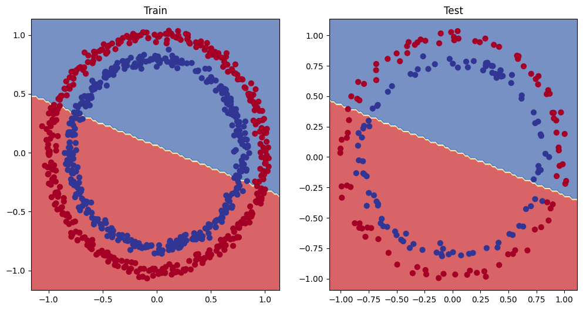
    


## 5. Improving a model (from a model perspective)

* Add more layers - give the model more chances to learn about patterns in the data
* Add more hidden units - go from 5 hidden units to 10 hidden units
* Fit for longer
* Changing the activation functions
* Change the learning rate
* Change the loss function

These options are all from a model's perspective bc they deal directly with the model, rather than the data.

And bc these options are all values we (as ML engineers and data scientists) can change, they are referred as **hyperparameters**.

Let's try and improve our model by:
* Adding more hidden units: 5 -> 10
* Increase the number of layers: 2 -> 3
* Increase the number of epochs: 100 -> 1000


```python
class CircleModelV1(nn.Module):
  def __init__(self):
    super().__init__()
    self.layer_1 = nn.Linear(in_features=2, out_features=10)
    self.layer_2 = nn.Linear(in_features=10, out_features=10)
    self.layer_3 = nn.Linear(in_features=10, out_features=1)

  def forward(self, x):
    # z = self.layer_1(x)
    # z = self.layer_2(z)
    # z = self.layer_3(z)
    return self.layer_3(self.layer_2(self.layer_1(x))) # this way of writing operations leverages speed ups where possible behind the scenes

model_1 = CircleModelV1().to(device)
model_1
```


    CircleModelV1(
      (layer_1): Linear(in_features=2, out_features=10, bias=True)
      (layer_2): Linear(in_features=10, out_features=10, bias=True)
      (layer_3): Linear(in_features=10, out_features=1, bias=True)
    )


```python
model_1.state_dict()
```


    OrderedDict([('layer_1.weight',
                  tensor([[ 0.5406,  0.5869],
                          [-0.1657,  0.6496],
                          [-0.1549,  0.1427],
                          [-0.3443,  0.4153],
                          [ 0.6233, -0.5188],
                          [ 0.6146,  0.1323],
                          [ 0.5224,  0.0958],
                          [ 0.3410, -0.0998],
                          [ 0.5451,  0.1045],
                          [-0.3301,  0.1802]], device='cuda:0')),
                 ('layer_1.bias',
                  tensor([-0.3258, -0.0829, -0.2872,  0.4691, -0.5582, -0.3260, -0.1997, -0.4252,
                           0.0667, -0.6984], device='cuda:0')),
                 ('layer_2.weight',
                  tensor([[ 0.2856, -0.2686,  0.2441,  0.0526, -0.1027,  0.1954,  0.0493,  0.2555,
                            0.0346, -0.0997],
                          [ 0.0850, -0.0858,  0.1331,  0.2823,  0.1828, -0.1382,  0.1825,  0.0566,
                            0.1606, -0.1927],
                          [-0.3130, -0.1222, -0.2426,  0.2595,  0.0911,  0.1310,  0.1000, -0.0055,
                            0.2475, -0.2247],
                          [ 0.0199, -0.2158,  0.0975, -0.1089,  0.0969, -0.0659,  0.2623, -0.1874,
                           -0.1886, -0.1886],
                          [ 0.2844,  0.1054,  0.3043, -0.2610, -0.3137, -0.2474, -0.2127,  0.1281,
                            0.1132,  0.2628],
                          [-0.1633, -0.2156,  0.1678, -0.1278,  0.1919, -0.0750,  0.1809, -0.2457,
                           -0.1596,  0.0964],
                          [ 0.0669, -0.0806,  0.1885,  0.2150, -0.2293, -0.1688,  0.2896, -0.1067,
                           -0.1121, -0.3060],
                          [-0.1811,  0.0790, -0.0417, -0.2295,  0.0074, -0.2160, -0.2683, -0.1741,
                           -0.2768, -0.2014],
                          [ 0.3161,  0.0597,  0.0974, -0.2949, -0.2077, -0.1053,  0.0494, -0.2783,
                           -0.1363, -0.1893],
                          [ 0.0009, -0.1177, -0.0219, -0.2143, -0.2171, -0.1845, -0.1082, -0.2496,
                            0.2651, -0.0628]], device='cuda:0')),
                 ('layer_2.bias',
                  tensor([ 0.2721,  0.0985, -0.2678,  0.2188, -0.0870, -0.1212, -0.2625, -0.3144,
                           0.0905, -0.0691], device='cuda:0')),
                 ('layer_3.weight',
                  tensor([[ 0.1231, -0.2595,  0.2348, -0.2321, -0.0546,  0.0661,  0.1633,  0.2553,
                            0.2881, -0.2507]], device='cuda:0')),
                 ('layer_3.bias', tensor([0.0796], device='cuda:0'))])


```python
# Create a loss function
loss_fn = torch.nn.BCEWithLogitsLoss()

# Create an optimizer
optim = torch.optim.SGD(params=model_1.parameters(),
                        lr=0.1)
```


```python
# Write a training and evaluation loop for model_1
torch.manual_seed(42)
torch.cuda.manual_seed(42)

# Train for longer
epochs = 1000

# Put data on the target device
X_train, y_train = X_train.to(device), y_train.to(device)
X_test, y_test = X_test.to(device), y_test.to(device)

for epoch in range(epochs):
  ### Training
  model_1.train()
  # 1. Forward pass
  y_logits = model_1(X_train).squeeze()
  y_pred = torch.round(torch.sigmoid(y_logits)) # logits -> pred probabilities -> prediction labels

  # 2. Calculate the loss/acc
  loss = loss_fn(y_logits, y_train)
  acc = accuracy_fn(y_true=y_train,
                    y_pred=y_pred)

  # 3. Optimizer zero grad
  optimizer.zero_grad()

  # 4. Loss backward (backpropagation)
  loss.backward()

  # 5. Optimizer setp (gradient descent)
  optimizer.step()

  ### Testing
  model_1.eval()
  with torch.inference_mode():
    # 1. Forward pass
    test_logits = model_1(X_test).squeeze()
    test_pred = torch.round(torch.sigmoid(test_logits))
    # 2. Calculate the loss
    test_loss = loss_fn(test_logits,
                        y_test)
    test_acc = accuracy_fn(y_true=y_test,
                           y_pred=test_pred)

  # Print out what's happening
  if epoch % 100 == 0:
    print(f"Epoch: {epoch} | Loss: {loss:.5f}, Acc: {acc:.2f}% | Test loss: {test_loss:.5f}, Test acc: {test_acc:.2f}%")
```

    Epoch: 0 | Loss: 0.69396, Acc: 50.88% | Test loss: 0.69261, Test acc: 51.00%
    Epoch: 100 | Loss: 0.69396, Acc: 50.88% | Test loss: 0.69261, Test acc: 51.00%
    Epoch: 200 | Loss: 0.69396, Acc: 50.88% | Test loss: 0.69261, Test acc: 51.00%
    Epoch: 300 | Loss: 0.69396, Acc: 50.88% | Test loss: 0.69261, Test acc: 51.00%
    Epoch: 400 | Loss: 0.69396, Acc: 50.88% | Test loss: 0.69261, Test acc: 51.00%
    Epoch: 500 | Loss: 0.69396, Acc: 50.88% | Test loss: 0.69261, Test acc: 51.00%
    Epoch: 600 | Loss: 0.69396, Acc: 50.88% | Test loss: 0.69261, Test acc: 51.00%
    Epoch: 700 | Loss: 0.69396, Acc: 50.88% | Test loss: 0.69261, Test acc: 51.00%
    Epoch: 800 | Loss: 0.69396, Acc: 50.88% | Test loss: 0.69261, Test acc: 51.00%
    Epoch: 900 | Loss: 0.69396, Acc: 50.88% | Test loss: 0.69261, Test acc: 51.00%


```python
# Plot decision boundary of the model
plt.figure(figsize=(12, 6))
plt.subplot(1, 2, 1) # rows, cols, index
plt.title("Train")
plot_decision_boundary(model_1, X_train, y_train)
plt.subplot(1, 2, 2)
plt.title("Test")
plot_decision_boundary(model_1, X_test, y_test)
```


    
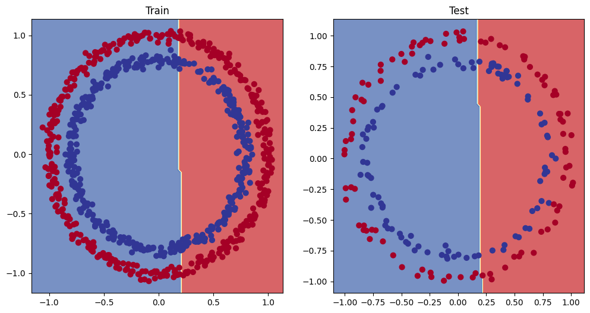
    


### 5.1 Preparing data to see if our model can fit a straight line

One way to troubleshoot to a larger problem is to test out a smaller problem.


```python
# Create some data (same as notebook 01)
weight = 0.7
bias = 0.3
start = 0
end = 1
step = 0.01

# Create data
X_regression = torch.arange(start, end, step).unsqueeze(dim=1)
y_regression = weight * X_regression + bias # Linear regression formula (without epsilon)

# Check the data
print(len(X_regression))
X_regression[:5], y_regression[:5]
```

    100


    (tensor([[0.0000],
             [0.0100],
             [0.0200],
             [0.0300],
             [0.0400]]),
     tensor([[0.3000],
             [0.3070],
             [0.3140],
             [0.3210],
             [0.3280]]))


```python
# Create train and test splits
train_split = int(0.8 * len(X_regression))
X_train_regression, y_train_regression = X_regression[:train_split], y_regression[:train_split]
X_test_regression, y_test_regression = X_regression[train_split:], y_regression[train_split:]

# Check the lengths of each
len(X_train_regression), len(X_test_regression), len(y_train_regression), len(y_test_regression)
```


    (80, 20, 80, 20)


```python
plot_predictions(train_data=X_train_regression,
                 train_labels=y_train_regression,
                 test_data=X_test_regression,
                 test_labels=y_test_regression);
```


    
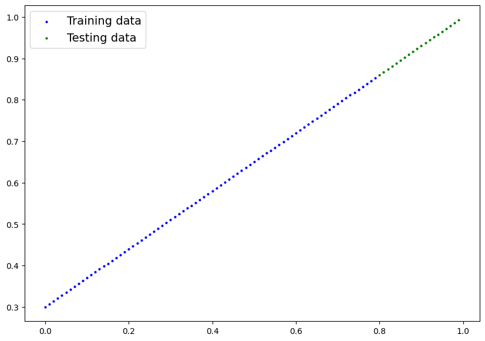
    


```python
X_train_regression[:10], y_train_regression[:10] # we have one feature per one label now!
```


    (tensor([[0.0000],
             [0.0100],
             [0.0200],
             [0.0300],
             [0.0400],
             [0.0500],
             [0.0600],
             [0.0700],
             [0.0800],
             [0.0900]]),
     tensor([[0.3000],
             [0.3070],
             [0.3140],
             [0.3210],
             [0.3280],
             [0.3350],
             [0.3420],
             [0.3490],
             [0.3560],
             [0.3630]]))


### 5.2 Adjusting `model_1` to fit a straight line


```python
# Same architecture as model_1 (but using nn.Sequential())
model_2 = nn.Sequential(
    nn.Linear(in_features=1, out_features=10),
    nn.Linear(in_features=10, out_features=10),
    nn.Linear(in_features=10, out_features=1)
).to(device)

model_2
```


    Sequential(
      (0): Linear(in_features=1, out_features=10, bias=True)
      (1): Linear(in_features=10, out_features=10, bias=True)
      (2): Linear(in_features=10, out_features=1, bias=True)
    )


```python
# Loss and optimizer
loss_fn = nn.L1Loss() # bc we are dealing with a regression problem, instead of a classification problem # MAE loss with regression data
optimizer = torch.optim.SGD(params=model_2.parameters(),
                            lr=0.01)
```


```python
# Train the model
torch.manual_seed(42)
torch.cuda.manual_seed(42)

# Set the number of epochs
epochs = 1000

# Put the data on the target device
X_train_regression, y_train_regression = X_train_regression.to(device), y_train_regression.to(device)
X_test_regression, y_test_regression = X_test_regression.to(device), y_test_regression.to(device)

# Training
for epoch in range(epochs):
  y_pred = model_2(X_train_regression)
  loss = loss_fn(y_pred, y_train_regression)
  optimizer.zero_grad()
  loss.backward()
  optimizer.step()

  # Testing
  model_2.eval()
  with torch.inference_mode():
    test_pred = model_2(X_test_regression)
    test_loss = loss_fn(test_pred, y_test_regression)

  # Print out what's happening
  if epoch % 100 == 0:
    print(f"Epoch: {epoch} | Loss: {loss:.5f} | Test loss: {test_loss:.5f}")
```

    Epoch: 0 | Loss: 0.75986 | Test loss: 0.91103
    Epoch: 100 | Loss: 0.02858 | Test loss: 0.00081
    Epoch: 200 | Loss: 0.02533 | Test loss: 0.00209
    Epoch: 300 | Loss: 0.02137 | Test loss: 0.00305
    Epoch: 400 | Loss: 0.01964 | Test loss: 0.00341
    Epoch: 500 | Loss: 0.01940 | Test loss: 0.00387
    Epoch: 600 | Loss: 0.01903 | Test loss: 0.00379
    Epoch: 700 | Loss: 0.01878 | Test loss: 0.00381
    Epoch: 800 | Loss: 0.01840 | Test loss: 0.00329
    Epoch: 900 | Loss: 0.01798 | Test loss: 0.00360


```python
# Turn on evaluation mode
model_2.eval()

# Make predictions (inference)
with torch.inference_mode():
  y_preds = model_2(X_test_regression)

# Plot data and predictions
plot_predictions(train_data=X_train_regression.cpu(),
                 train_labels=y_train_regression.cpu(),
                 test_data=X_test_regression.cpu(),
                 test_labels=y_test_regression.cpu(),
                 predictions=y_preds.cpu());
```


    
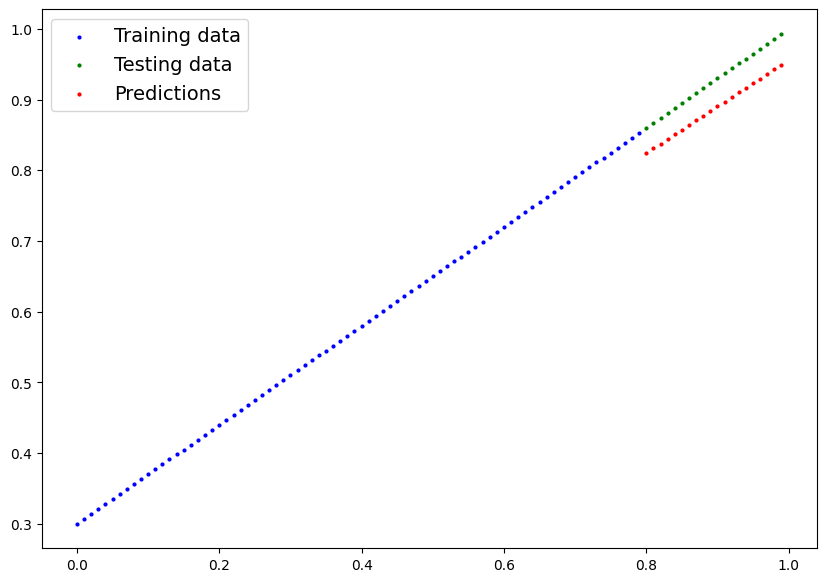
    


## 6. The missing piece: non-linearity

"What patterns could you draw if you were given an infinite amount of straight and non-straight lines?"

Or in ML terms, an infinite (but really it is finite) of linear and non-linear functions?


### 6.1 Recreating non-linear data (red and blue circles)


```python
# Make and plot data
import matplotlib.pyplot as plt
from sklearn.datasets import make_circles

n_samples = 1000

X, y = make_circles(n_samples,
                    noise=0.03,
                    random_state=42)

plt.scatter(X[:, 0], X[:, 1], c=y, cmap=plt.cm.RdYlBu);
```


    

    


```python
# Convert data to tensors and then to train and test splits
import torch
from sklearn.model_selection import train_test_split

# Turn data into tensors
X = torch.from_numpy(X).type(torch.float)
y = torch.from_numpy(y).type(torch.float)

# Split into train and test sets
X_train, X_teset, y_train, y_test = train_test_split(X,
                                                     y,
                                                     test_size=0.2,
                                                     random_state=42)

X_train[:5], y_train[:5]
```


    (tensor([[ 0.6579, -0.4651],
             [ 0.6319, -0.7347],
             [-1.0086, -0.1240],
             [-0.9666, -0.2256],
             [-0.1666,  0.7994]]),
     tensor([1., 0., 0., 0., 1.]))


### 6.2 Building a model with non-linearity

* Linear = straight line
* Non-linear = non-straight line

Artificial neural networks are a large combination of linear (straight) and non-straight (non-linear) functions which are potentially able to find patterns in data.


```python
# Build a model with non-linear activation functions
from torch import nn
class CircleModelV2(nn.Module):
  def __init__(self):
    super().__init__()
    self.layer_1 = nn.Linear(in_features=2, out_features=10)
    self.layer_2 = nn.Linear(in_features=10, out_features=10)
    self.layer_3 = nn.Linear(in_features=10, out_features=1)
    self.relu = nn.ReLU() # relu is a non-linear activation function, turns neg values to 0 and leaves pos values

  def forward(self, x):
    # Were should we put our non-linear activation functions?
    return self.layer_3(self.relu(self.layer_2(self.relu(self.layer_1(x)))))

model_3 = CircleModelV2().to(device)
model_3
```


    CircleModelV2(
      (layer_1): Linear(in_features=2, out_features=10, bias=True)
      (layer_2): Linear(in_features=10, out_features=10, bias=True)
      (layer_3): Linear(in_features=10, out_features=1, bias=True)
      (relu): ReLU()
    )


```python
# Setup loss and optimizer
loss_fn = nn.BCEWithLogitsLoss()
optimizer = torch.optim.SGD(params=model_3.parameters(),
                            lr=1.0)
```

### 6.3 Training a model with non-linearity


```python
# Random seeds
torch.manual_seed(42)
torch.cuda.manual_seed(42)

# Put all data on target device
X_train, y_train = X_train.to(device), y_train.to(device)
X_test, y_test = X_test.to(device), y_test.to(device)

# Loop through data
epochs = 1000

for epoch in range(epochs):
  ### Training
  model_3.train()

  # 1. Forward pass
  y_logits = model_3(X_train).squeeze()
  y_pred = torch.round(torch.sigmoid(y_logits)) # logits -> prediction probabilities -> prediction labels

  # 2. Calculate the loss
  loss = loss_fn(y_logits, y_train) # BCEWithLogitsLoss (takes in logits as first input)
  acc = accuracy_fn(y_true=y_train,
                    y_pred=y_pred)

  # 3. Optimizer zero grad
  optimizer.zero_grad()

  # 4. Loss backward
  loss.backward()

  # 5. Optimizer step
  optimizer.step()

  ### Testing
  model_3.eval()
  with torch.inference_mode():
    test_logits = model_3(X_test).squeeze()
    test_pred = torch.round(torch.sigmoid(test_logits))

    test_loss = loss_fn(test_logits, y_test)
    test_acc = accuracy_fn(y_true=y_test,
                           y_pred=test_pred)

  # Print out what's happening
  if epoch % 100 == 0:
    print(f"Epoch: {epoch} | Loss: {loss:.4f}, Acc: {acc:.2f}% | Test loss: {test_loss:.4f}, Test Acc: {test_acc:.2f}%")
```

    Epoch: 0 | Loss: 0.6929, Acc: 50.00% | Test loss: 0.6926, Test Acc: 50.00%
    Epoch: 100 | Loss: 0.5772, Acc: 86.38% | Test loss: 0.5762, Test Acc: 86.50%
    Epoch: 200 | Loss: 1.4209, Acc: 50.00% | Test loss: 0.5730, Test Acc: 62.50%
    Epoch: 300 | Loss: 0.2256, Acc: 97.38% | Test loss: 0.2157, Test Acc: 97.00%
    Epoch: 400 | Loss: 0.0256, Acc: 100.00% | Test loss: 0.0445, Test Acc: 100.00%
    Epoch: 500 | Loss: 0.0093, Acc: 100.00% | Test loss: 0.0244, Test Acc: 100.00%
    Epoch: 600 | Loss: 0.0056, Acc: 100.00% | Test loss: 0.0174, Test Acc: 100.00%
    Epoch: 700 | Loss: 0.0039, Acc: 100.00% | Test loss: 0.0142, Test Acc: 100.00%
    Epoch: 800 | Loss: 0.0030, Acc: 100.00% | Test loss: 0.0124, Test Acc: 100.00%
    Epoch: 900 | Loss: 0.0025, Acc: 100.00% | Test loss: 0.0112, Test Acc: 100.00%


### 6.4 Evaluating a model trained with non-linear activation functions


```python
# Make predictions
model_3.eval()
with torch.inference_mode():
  y_preds = torch.round(torch.sigmoid(model_3(X_test))).squeeze()
y_preds[:10],  y_test[:10]
```


    (tensor([1., 0., 1., 0., 1., 1., 0., 0., 1., 0.], device='cuda:0'),
     tensor([1., 0., 1., 0., 1., 1., 0., 0., 1., 0.], device='cuda:0'))


```python
# Plot decision boundaries
plt.figure(figsize=(12, 6))
plt.subplot(1, 2, 1)
plt.title("Train")
plot_decision_boundary(model_1, X_train, y_train) # model_1 = no non-linearity
plt.subplot(1, 2, 2)
plt.title("Test")
plot_decision_boundary(model_3, X_test, y_test) # model_3 = non-linearity
```


    
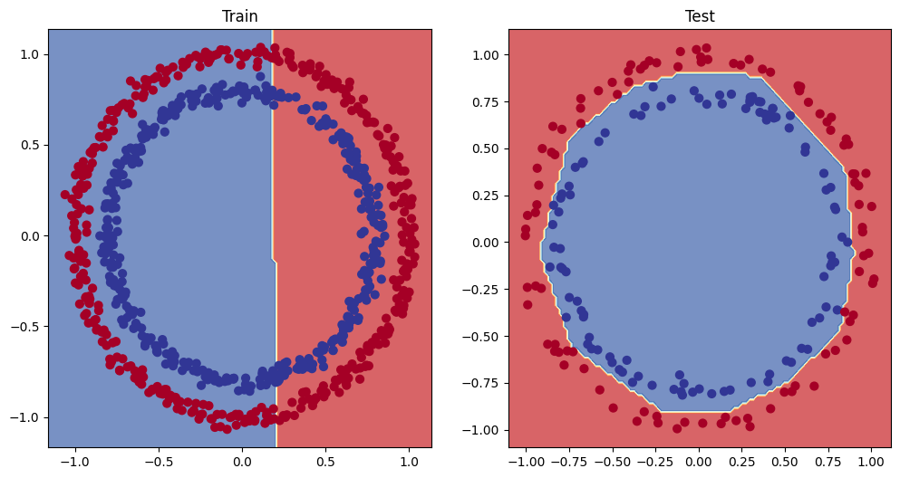
    


**Challenge:** Improve the model_3 to do better than 80% accuracy on the test data

**Solution:** Solved by adjusting the learning rate to `lr = 1.0`

## 7. Replicating non-linear activation functions

Neural networks, rather than telling the model what to learn, we give it the tools to discover patterns in data and it tries to figure out the patterns on its own.

And these tools are linear & non-linear functions.


```python
# Create a tensor
A = torch.arange(-10, 10, 1, dtype=torch.float32)
A.dtype
```


    torch.float32


```python
A
```


    tensor([-10.,  -9.,  -8.,  -7.,  -6.,  -5.,  -4.,  -3.,  -2.,  -1.,   0.,   1.,
              2.,   3.,   4.,   5.,   6.,   7.,   8.,   9.])


```python
# Visualize the tensor
plt.plot(A);
```


    
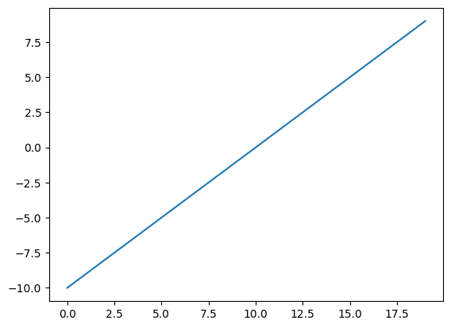
    


```python
plt.plot(torch.relu(A));
```


    
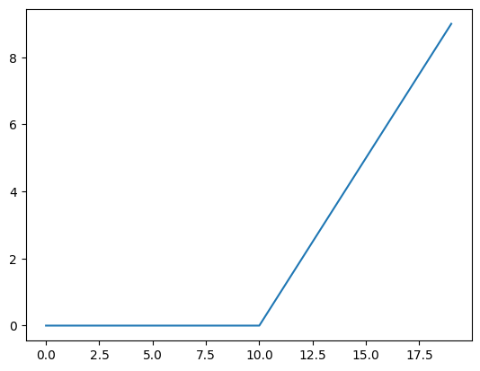
    


```python
def relu(x: torch.Tensor) -> torch.Tensor:
  return torch.maximum(torch.tensor(0), x) # inputs must be tensors

relu(A)
```


    tensor([0., 0., 0., 0., 0., 0., 0., 0., 0., 0., 0., 1., 2., 3., 4., 5., 6., 7.,
            8., 9.])


```python
# Plot ReLU activation function
plt.plot(relu(A));
```


    

    


```python
# Now let's do the same for sigmoid - https://pytorch.org/docs/stable/generated/torch.nn.Sigmoid.html
def sigmoid(x: torch.Tensor):
  return 1 / (1 + torch.exp(-x))
```


```python
plt.plot(torch.sigmoid(A));
```


    
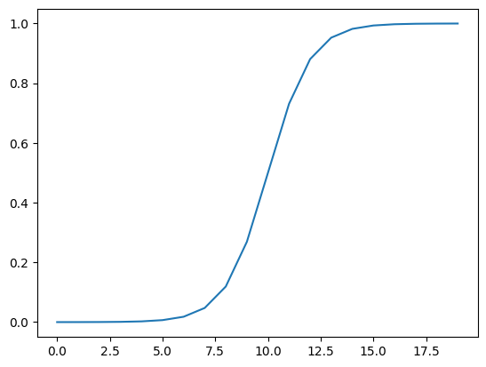
    


```python
plt.plot(sigmoid(A));
```


    

    


## 8. Putting it all together with a multi-class classification problem

* Binary classification = one thing or another (cat vs. dog, spam vs. not spam, fraud or not fraud)
* Multi-class classification = more than one thing or another (cat vs. dog vs. chicken)

### 8.1 Creating a toy multi-class dataset


```python
# Import dependencies
import torch
import matplotlib.pyplot as plt
from sklearn.datasets import make_blobs # https://scikit-learn.org/1.5/modules/generated/sklearn.datasets.make_blobs.html
from sklearn.model_selection import train_test_split

# Set the hyperparameters for data creation (often in capital letters)
NUM_CLASSES = 4
NUM_FEATURES = 2
RANDOM_SEED = 42

# 1. Create multi-class data
X_blob, y_blob = make_blobs(n_samples=1000,
                            n_features=NUM_FEATURES,
                            centers=NUM_CLASSES,
                            cluster_std=1.5, # give the clusters a little shake up
                            random_state=RANDOM_SEED)

# 2. Turn data into tensors
X_blob = torch.from_numpy(X_blob).type(torch.float)
y_blob = torch.from_numpy(y_blob).type(torch.LongTensor)

# 3. Split into train and test
X_blob_train, X_blob_test, y_blob_train, y_blob_test = train_test_split(X_blob,
                                                                        y_blob,
                                                                        test_size=0.2,
                                                                        random_state=RANDOM_SEED)

# 4. Plot data (visualize, visualize, visualize)
plt.figure(figsize=(10, 7))
plt.scatter(X_blob[:, 0], X_blob[:, 1], c=y_blob, cmap=plt.cm.RdYlBu);
```


    
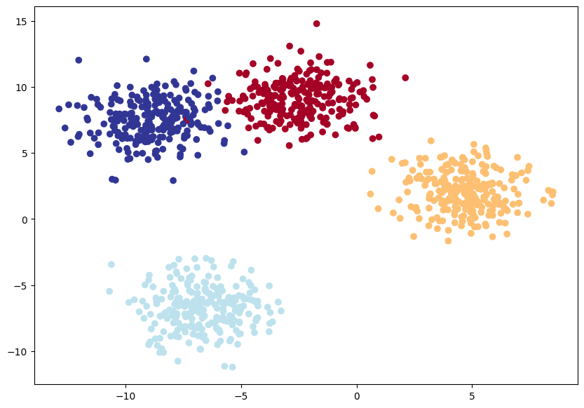
    


### 8.2 Building a multi-class classification model in PyTorch


```python
# Create device agnostic code
device = "cuda" if torch.cuda.is_available() else "cpu"
device
```


    'cuda'


```python
# Build a multi-class classification model
class BlobModel(nn.Module):
  def __init__(self, input_features, output_features, hidden_units=8):
    """Initializes multi-class classification model.

    Args:
      input_features (int): Number of input features to the model
      output_features (int): Number of output features (number of output classes)
      hidden_units (int): Number of hidden units between layers, default 8

    Returns: model with the specified features

    Example: -
    """
    super().__init__()
    self.linear_layer_stack = nn.Sequential(
        nn.Linear(in_features=input_features, out_features=hidden_units),
        nn.ReLU(),
        nn.Linear(in_features=hidden_units, out_features=hidden_units),
        nn.ReLU(),
        nn.Linear(in_features=hidden_units, out_features=output_features)
    )

  def forward(self, x):
    return self.linear_layer_stack(x)

# Create an instance of BlobModel and send it to the target device
model_4 = BlobModel(input_features=2,
                    output_features=4,
                    hidden_units=8).to(device)

model_4
```


    BlobModel(
      (linear_layer_stack): Sequential(
        (0): Linear(in_features=2, out_features=8, bias=True)
        (1): ReLU()
        (2): Linear(in_features=8, out_features=8, bias=True)
        (3): ReLU()
        (4): Linear(in_features=8, out_features=4, bias=True)
      )
    )


```python
X_blob_train.shape, y_blob_train[:5]
```


    (torch.Size([800, 2]), tensor([1, 0, 2, 2, 0]))


```python
torch.unique(y_blob_train) # shows the classes
```


    tensor([0, 1, 2, 3])


### 8.3 Create a loss function and an optimizer for a multi-class classification model


```python
# Create a loss function for multi-class classification - loss function measures how wrong our model's prediction are
loss_fn = nn.CrossEntropyLoss()

# Create an optimizer for multi-class classification - optimizer updates our model parameters to try and reduce the loss
optimizer = torch.optim.SGD(params=model_4.parameters(),
                            lr=0.1) # learning rate is a hyperparamete you can change
```

### 8.4 Getting prediction probabilities for a multi-class PyTorch model

In order to evaluate and train and test our model, we need to convert our model's outputs (logits) to prediction probabilities and then to prediction labels.

Logits (raw output of the model) -> Pred probs (use `torch.softmax`) -> Pred labels (take the argmax of the prediction probabilities)


```python
# Lets's get some raw outputs of our model (logits)
model_4.eval()
with torch.inference_mode():
  y_logits = model_4(X_blob_test.to(device))

y_logits[:10]
```


    tensor([[-0.7646, -0.7412, -1.5777, -1.1376],
            [-0.0973, -0.9431, -0.5963, -0.1371],
            [ 0.2528, -0.2379,  0.1882, -0.0066],
            [-0.4134, -0.5204, -0.9303, -0.6963],
            [-0.3118, -1.3736, -1.1991, -0.3834],
            [-0.1497, -1.0617, -0.7107, -0.1645],
            [ 0.1539, -0.2887,  0.1520, -0.0109],
            [-0.2154, -1.1795, -0.9300, -0.2745],
            [ 0.2443, -0.2472,  0.1649,  0.0061],
            [-0.2329, -1.2120, -0.9849, -0.3004]], device='cuda:0')


```python
y_blob_test[:10]
```


    tensor([1, 3, 2, 1, 0, 3, 2, 0, 2, 0])


```python
# Convert our model's logit outputs to prediction probabilities
y_pred_probs = torch.softmax(y_logits, dim=1)
print(y_logits[:5])
print(y_pred_probs[:5])
```

    tensor([[-0.7646, -0.7412, -1.5777, -1.1376],
            [-0.0973, -0.9431, -0.5963, -0.1371],
            [ 0.2528, -0.2379,  0.1882, -0.0066],
            [-0.4134, -0.5204, -0.9303, -0.6963],
            [-0.3118, -1.3736, -1.1991, -0.3834]], device='cuda:0')
    tensor([[0.3169, 0.3244, 0.1405, 0.2182],
            [0.3336, 0.1432, 0.2026, 0.3206],
            [0.3011, 0.1843, 0.2823, 0.2323],
            [0.3078, 0.2766, 0.1836, 0.2320],
            [0.3719, 0.1286, 0.1532, 0.3463]], device='cuda:0')


```python
torch.sum(y_pred_probs[0])
```


    tensor(1., device='cuda:0')


```python
torch.argmax(y_pred_probs[0]) # for sample 0, class 1 is the right class
```


    tensor(1, device='cuda:0')


```python
# Convert our model's prediction probabilities to prediction labels
y_preds = torch.argmax(y_pred_probs, dim=1)
y_preds
```


    tensor([1, 0, 0, 0, 0, 0, 0, 0, 0, 0, 0, 1, 0, 0, 0, 0, 0, 0, 0, 0, 0, 0, 0, 0,
            0, 0, 0, 0, 0, 0, 0, 1, 0, 0, 1, 0, 0, 0, 0, 0, 0, 0, 0, 0, 0, 0, 0, 0,
            0, 3, 0, 0, 0, 0, 0, 0, 0, 1, 0, 0, 0, 0, 0, 0, 0, 0, 0, 0, 0, 0, 0, 0,
            0, 0, 0, 0, 0, 0, 0, 0, 0, 0, 0, 0, 0, 0, 0, 0, 0, 0, 0, 0, 1, 0, 0, 0,
            1, 0, 0, 0, 0, 0, 0, 0, 0, 0, 0, 0, 0, 0, 0, 0, 0, 0, 0, 0, 0, 0, 0, 0,
            0, 0, 0, 0, 0, 0, 0, 0, 0, 0, 0, 0, 0, 0, 0, 3, 0, 0, 1, 0, 1, 0, 0, 0,
            0, 0, 0, 0, 3, 0, 0, 1, 0, 0, 0, 0, 0, 0, 0, 1, 0, 0, 0, 0, 0, 0, 0, 0,
            0, 0, 0, 0, 0, 1, 1, 1, 0, 0, 0, 1, 0, 0, 0, 1, 0, 0, 0, 0, 0, 0, 0, 0,
            1, 0, 0, 0, 0, 1, 0, 1], device='cuda:0')


```python
y_blob_test
```


    tensor([1, 3, 2, 1, 0, 3, 2, 0, 2, 0, 0, 1, 0, 0, 0, 3, 3, 2, 3, 3, 3, 0, 1, 2,
            2, 2, 3, 0, 1, 0, 3, 1, 1, 3, 1, 2, 1, 3, 0, 2, 0, 3, 3, 2, 0, 3, 1, 1,
            0, 3, 1, 0, 1, 1, 3, 2, 1, 1, 3, 2, 2, 0, 3, 2, 2, 0, 0, 3, 3, 0, 0, 3,
            3, 3, 2, 3, 3, 3, 3, 1, 0, 2, 3, 2, 3, 3, 2, 3, 3, 2, 3, 3, 1, 3, 3, 3,
            1, 0, 3, 2, 0, 0, 3, 0, 2, 3, 1, 0, 3, 2, 1, 1, 0, 2, 2, 3, 0, 0, 1, 2,
            2, 3, 0, 1, 2, 0, 0, 0, 2, 3, 1, 2, 3, 2, 0, 3, 0, 0, 1, 1, 1, 0, 2, 2,
            2, 2, 0, 3, 3, 2, 2, 1, 3, 2, 0, 0, 3, 3, 2, 1, 2, 0, 3, 2, 0, 3, 2, 0,
            2, 2, 2, 0, 3, 1, 1, 1, 1, 1, 3, 1, 0, 2, 2, 1, 2, 2, 0, 1, 2, 2, 0, 0,
            1, 3, 2, 0, 3, 1, 2, 1])


### 8.5 Create a training loop and testing loop for a multi-class PyTorch model


```python
# Fit the multi-class model to the data
torch.manual_seed(42)
torch.cuda.manual_seed(42)

# Set number of epochs
epochs = 100

# Put data to target device
X_blob_train, y_blob_train = X_blob_train.to(device), y_blob_train.to(device)
X_blob_test, y_blob_test = X_blob_test.to(device), y_blob_test.to(device)

# Loop through data
for epoch in range(epochs):
  ### Training
  model_4.train()

  y_logits = model_4(X_blob_train).squeeze()
  y_pred = torch.softmax(y_logits, dim=1).argmax(dim=1)

  loss = loss_fn(y_logits, y_blob_train)
  acc = accuracy_fn(y_true=y_blob_train,
                    y_pred=y_pred)

  optimizer.zero_grad()
  loss.backward()
  optimizer.step()

  ### Testing
  model_4.eval()
  with torch.inference_mode():
    test_logits = model_4(X_blob_test).squeeze()
    test_preds = torch.softmax(test_logits, dim=1).argmax(dim=1)

    test_loss = loss_fn(test_logits, y_blob_test)
    test_acc = accuracy_fn(y_true=y_blob_test,
                           y_pred=test_preds)

  # Print out what's happening
  if epoch % 10 == 0:
    print(f"Epoch: {epoch} | Loss: {loss:.4f}, Acc: {acc:.2f}% | Test loss: {test_loss:.4f}, Test Acc: {test_acc:.2f}%")
```

    Epoch: 0 | Loss: 1.1588, Acc: 40.38% | Test loss: 1.0755, Test Acc: 48.00%
    Epoch: 10 | Loss: 0.6448, Acc: 96.75% | Test loss: 0.6607, Test Acc: 97.50%
    Epoch: 20 | Loss: 0.4254, Acc: 98.50% | Test loss: 0.4307, Test Acc: 100.00%
    Epoch: 30 | Loss: 0.2529, Acc: 99.12% | Test loss: 0.2451, Test Acc: 99.50%
    Epoch: 40 | Loss: 0.1123, Acc: 99.25% | Test loss: 0.1023, Test Acc: 99.50%
    Epoch: 50 | Loss: 0.0663, Acc: 99.25% | Test loss: 0.0585, Test Acc: 99.50%
    Epoch: 60 | Loss: 0.0507, Acc: 99.25% | Test loss: 0.0429, Test Acc: 99.50%
    Epoch: 70 | Loss: 0.0430, Acc: 99.25% | Test loss: 0.0349, Test Acc: 99.50%
    Epoch: 80 | Loss: 0.0384, Acc: 99.25% | Test loss: 0.0299, Test Acc: 99.50%
    Epoch: 90 | Loss: 0.0352, Acc: 99.25% | Test loss: 0.0266, Test Acc: 99.50%


### 8.6 Making and evaluating predictions with a PyTorch multi-class model


```python
# Make predictions
model_4.eval()
with torch.inference_mode():
  y_logits = model_4(X_blob_test)

# View the first 10 predictions
y_logits[:10]
```


    tensor([[-0.6249,  5.9860, -7.6323, -8.4470],
            [-2.1738, -6.3750, -3.7202,  3.1203],
            [-3.4102, -3.8958,  3.1567, -2.6119],
            [-1.1505,  4.1962, -3.8472, -4.8820],
            [ 3.7548, -1.3391, -9.1422, -6.9466],
            [-2.8211, -7.5767, -4.2944,  3.7944],
            [-3.0306, -3.3328,  2.7955, -2.1374],
            [ 3.3761, -4.0375, -6.8987, -3.5503],
            [-4.3620, -4.9904,  3.8123, -3.3814],
            [ 3.5012, -3.0281, -7.5401, -4.7064]], device='cuda:0')


```python
# Go from logits -> Prediction probabilities
y_pred_probs = torch.softmax(y_logits, dim=1)
y_pred_probs[:10]
```


    tensor([[1.3438e-03, 9.9865e-01, 1.2164e-06, 5.3854e-07],
            [4.9905e-03, 7.4740e-05, 1.0630e-03, 9.9387e-01],
            [1.3985e-03, 8.6060e-04, 9.9463e-01, 3.1073e-03],
            [4.7389e-03, 9.9483e-01, 3.1956e-04, 1.1353e-04],
            [9.9388e-01, 6.0966e-03, 2.4904e-06, 2.2378e-05],
            [1.3372e-03, 1.1504e-05, 3.0644e-04, 9.9834e-01],
            [2.9138e-03, 2.1537e-03, 9.8781e-01, 7.1181e-03],
            [9.9838e-01, 6.0198e-04, 3.4435e-05, 9.7989e-04],
            [2.8147e-04, 1.5016e-04, 9.9882e-01, 7.5044e-04],
            [9.9825e-01, 1.4575e-03, 1.5998e-05, 2.7210e-04]], device='cuda:0')


```python
# Go from pred probs to pred labels
y_preds = torch.argmax(y_pred_probs, dim=1)
y_preds[:10]
```


    tensor([1, 3, 2, 1, 0, 3, 2, 0, 2, 0], device='cuda:0')


```python
plt.figure(figsize=(12, 6))
plt.subplot(1, 2, 1)
plt.title("Train")
plot_decision_boundary(model_4, X_blob_train, y_blob_train)
plt.subplot(1, 2, 2)
plt.title("Test")
plot_decision_boundary(model_4, X_blob_test, y_blob_test)
```


    
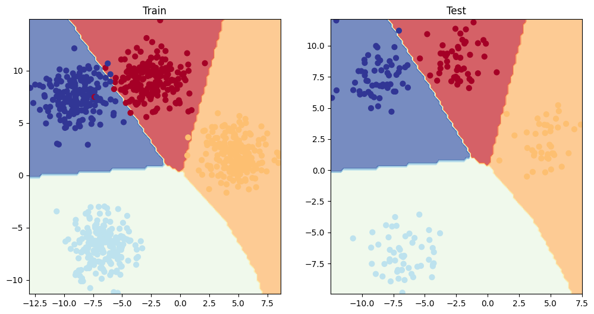
    


The model can also work pretty good without the ReLU layers, bc the data is linearly separable.

## 9. A few more classification metrics... (to evaluate our classification model)

* Accuracy - out of 100 samples, how many does our model get right?
* Precision
* Recall
* F1-score
* Confusion matrix
* Classification report

See this article for when to use precision and recall - https://towardsdatascience.com/beyond-accuracy-precision-and-recall-3da06bea9f6c

If you want access to a lot of PyTorch metrics, see TorchMetrics - https://lightning.ai/docs/torchmetrics/stable/


```python
!pip install torchmetrics
```

    Requirement already satisfied: torchmetrics in /usr/local/lib/python3.10/dist-packages (1.6.1)
    Requirement already satisfied: numpy>1.20.0 in /usr/local/lib/python3.10/dist-packages (from torchmetrics) (1.26.4)
    Requirement already satisfied: packaging>17.1 in /usr/local/lib/python3.10/dist-packages (from torchmetrics) (24.2)
    Requirement already satisfied: torch>=2.0.0 in /usr/local/lib/python3.10/dist-packages (from torchmetrics) (2.5.1+cu121)
    Requirement already satisfied: lightning-utilities>=0.8.0 in /usr/local/lib/python3.10/dist-packages (from torchmetrics) (0.11.9)
    Requirement already satisfied: setuptools in /usr/local/lib/python3.10/dist-packages (from lightning-utilities>=0.8.0->torchmetrics) (75.1.0)
    Requirement already satisfied: typing-extensions in /usr/local/lib/python3.10/dist-packages (from lightning-utilities>=0.8.0->torchmetrics) (4.12.2)
    Requirement already satisfied: filelock in /usr/local/lib/python3.10/dist-packages (from torch>=2.0.0->torchmetrics) (3.16.1)
    Requirement already satisfied: networkx in /usr/local/lib/python3.10/dist-packages (from torch>=2.0.0->torchmetrics) (3.4.2)
    Requirement already satisfied: jinja2 in /usr/local/lib/python3.10/dist-packages (from torch>=2.0.0->torchmetrics) (3.1.4)
    Requirement already satisfied: fsspec in /usr/local/lib/python3.10/dist-packages (from torch>=2.0.0->torchmetrics) (2024.10.0)
    Requirement already satisfied: sympy==1.13.1 in /usr/local/lib/python3.10/dist-packages (from torch>=2.0.0->torchmetrics) (1.13.1)
    Requirement already satisfied: mpmath<1.4,>=1.1.0 in /usr/local/lib/python3.10/dist-packages (from sympy==1.13.1->torch>=2.0.0->torchmetrics) (1.3.0)
    Requirement already satisfied: MarkupSafe>=2.0 in /usr/local/lib/python3.10/dist-packages (from jinja2->torch>=2.0.0->torchmetrics) (3.0.2)


```python
from torchmetrics import Accuracy

# Setup metric
torchmetric_accuracy = Accuracy(task="multiclass", num_classes=4).to(device)

# Calculate accuracy
torchmetric_accuracy(y_preds, y_blob_test)
```


    tensor(0.9950, device='cuda:0')


