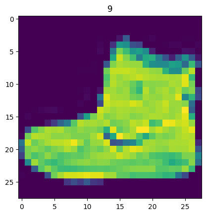
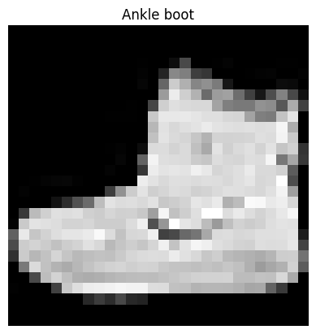
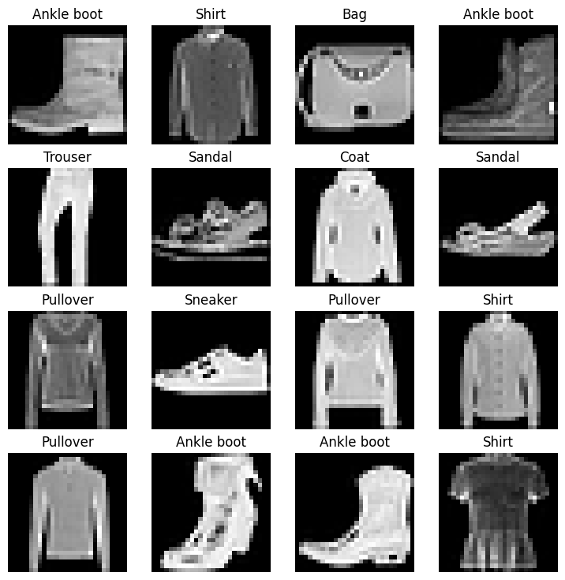
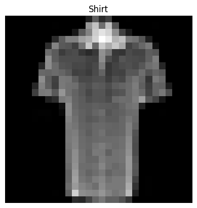
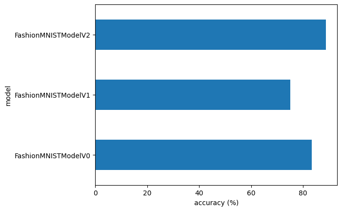
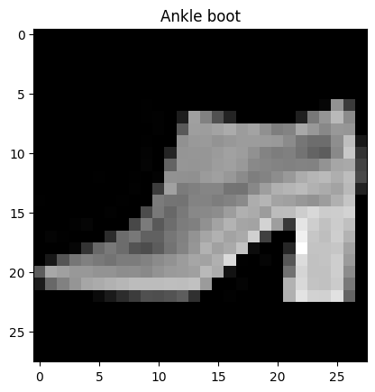
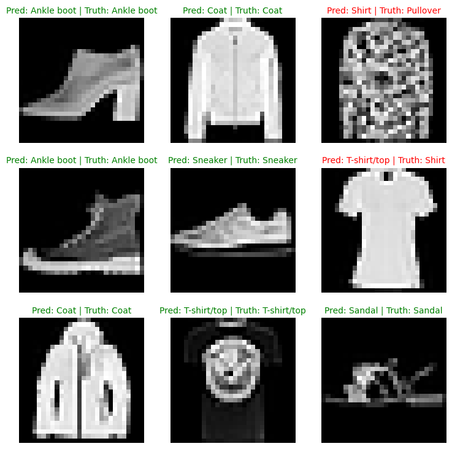
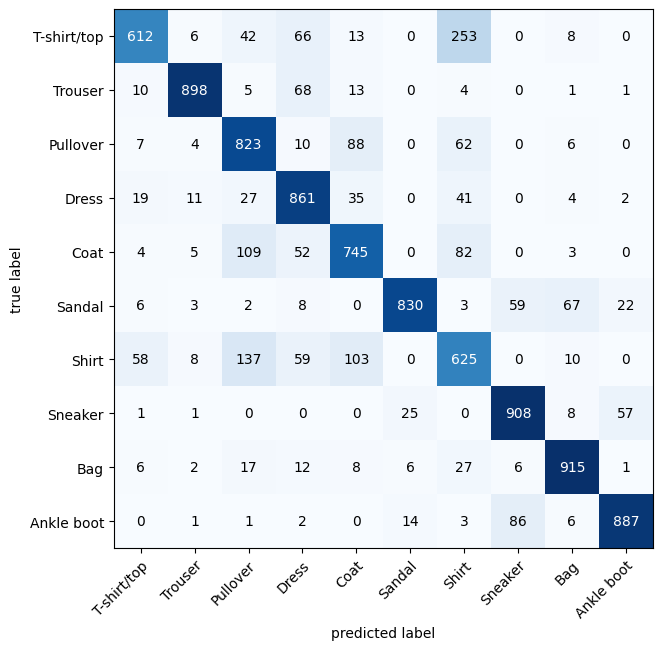

# PyTorch Computer Vision

* See reference notebook - https://github.com/mrdbourke/pytorch-deep-learning/blob/main/03_pytorch_computer_vision.ipynb
* See reference online book - https://www.learnpytorch.io/03_pytorch_computer_vision/

## 0. Computer vision libraries in PyTorch

* [`torchvision`](https://pytorch.org/vision/stable/index.html) - base domain for PyTorch computer vision
* `torchvision.datasets` - get datasets and data loading functions for computer vision here
* `torchvision.models` - get pretrained computer vision models that you can leverage for your own problems
* `torchvision.transforms` - functions for manipulating your vision data (images) to be suitable for use with an ML model
* `torch.utils.data.Dataset` - Base dataset class for PyTorch
* `torch.utils.data.DataLoader` - Creates a Python iterable ober a dataset


```python
# Import PyTorch
import torch
from torch import nn

# Import torchvision
import torchvision
from torchvision import datasets
from torchvision import transforms
from torchvision.transforms import ToTensor

# Import matplotlib for visualization
import matplotlib.pyplot as plt

# Check versions
print(torch.__version__)
print(torchvision.__version__)
```

    2.5.1+cu121
    0.20.1+cu121


## 1. Getting a dataset

The dataset we'll be using is FashionMNIST from torchvision.datasets - https://pytorch.org/vision/stable/generated/torchvision.datasets.FashionMNIST.html#torchvision.datasets.FashionMNIST


```python
# Setup training data
from torchvision import datasets

train_data = datasets.FashionMNIST(
    root="data", # where to download data to?
    train=True, # do we want the training dataset?
    download=True, # do we want to download? yes/no
    transform=torchvision.transforms.ToTensor(), # how do we want to transform the data?
    target_transform=None # how do we want to transform the labels/targets?
)

test_data = datasets.FashionMNIST(
    root="data",
    train=False,
    download=True,
    transform=ToTensor(),
    target_transform=None
)
```


```python
len(train_data), len(test_data)
```


    (60000, 10000)


```python
# See the first training example
image, label = train_data[0]
image, label
```


    (tensor([[[0.0000, 0.0000, 0.0000, 0.0000, 0.0000, 0.0000, 0.0000, 0.0000,
               0.0000, 0.0000, 0.0000, 0.0000, 0.0000, 0.0000, 0.0000, 0.0000,
               0.0000, 0.0000, 0.0000, 0.0000, 0.0000, 0.0000, 0.0000, 0.0000,
               0.0000, 0.0000, 0.0000, 0.0000],
              [0.0000, 0.0000, 0.0000, 0.0000, 0.0000, 0.0000, 0.0000, 0.0000,
               0.0000, 0.0000, 0.0000, 0.0000, 0.0000, 0.0000, 0.0000, 0.0000,
               0.0000, 0.0000, 0.0000, 0.0000, 0.0000, 0.0000, 0.0000, 0.0000,
               0.0000, 0.0000, 0.0000, 0.0000],
              [0.0000, 0.0000, 0.0000, 0.0000, 0.0000, 0.0000, 0.0000, 0.0000,
               0.0000, 0.0000, 0.0000, 0.0000, 0.0000, 0.0000, 0.0000, 0.0000,
               0.0000, 0.0000, 0.0000, 0.0000, 0.0000, 0.0000, 0.0000, 0.0000,
               0.0000, 0.0000, 0.0000, 0.0000],
              [0.0000, 0.0000, 0.0000, 0.0000, 0.0000, 0.0000, 0.0000, 0.0000,
               0.0000, 0.0000, 0.0000, 0.0000, 0.0039, 0.0000, 0.0000, 0.0510,
               0.2863, 0.0000, 0.0000, 0.0039, 0.0157, 0.0000, 0.0000, 0.0000,
               0.0000, 0.0039, 0.0039, 0.0000],
              [0.0000, 0.0000, 0.0000, 0.0000, 0.0000, 0.0000, 0.0000, 0.0000,
               0.0000, 0.0000, 0.0000, 0.0000, 0.0118, 0.0000, 0.1412, 0.5333,
               0.4980, 0.2431, 0.2118, 0.0000, 0.0000, 0.0000, 0.0039, 0.0118,
               0.0157, 0.0000, 0.0000, 0.0118],
              [0.0000, 0.0000, 0.0000, 0.0000, 0.0000, 0.0000, 0.0000, 0.0000,
               0.0000, 0.0000, 0.0000, 0.0000, 0.0235, 0.0000, 0.4000, 0.8000,
               0.6902, 0.5255, 0.5647, 0.4824, 0.0902, 0.0000, 0.0000, 0.0000,
               0.0000, 0.0471, 0.0392, 0.0000],
              [0.0000, 0.0000, 0.0000, 0.0000, 0.0000, 0.0000, 0.0000, 0.0000,
               0.0000, 0.0000, 0.0000, 0.0000, 0.0000, 0.0000, 0.6078, 0.9255,
               0.8118, 0.6980, 0.4196, 0.6118, 0.6314, 0.4275, 0.2510, 0.0902,
               0.3020, 0.5098, 0.2824, 0.0588],
              [0.0000, 0.0000, 0.0000, 0.0000, 0.0000, 0.0000, 0.0000, 0.0000,
               0.0000, 0.0000, 0.0000, 0.0039, 0.0000, 0.2706, 0.8118, 0.8745,
               0.8549, 0.8471, 0.8471, 0.6392, 0.4980, 0.4745, 0.4784, 0.5725,
               0.5529, 0.3451, 0.6745, 0.2588],
              [0.0000, 0.0000, 0.0000, 0.0000, 0.0000, 0.0000, 0.0000, 0.0000,
               0.0000, 0.0039, 0.0039, 0.0039, 0.0000, 0.7843, 0.9098, 0.9098,
               0.9137, 0.8980, 0.8745, 0.8745, 0.8431, 0.8353, 0.6431, 0.4980,
               0.4824, 0.7686, 0.8980, 0.0000],
              [0.0000, 0.0000, 0.0000, 0.0000, 0.0000, 0.0000, 0.0000, 0.0000,
               0.0000, 0.0000, 0.0000, 0.0000, 0.0000, 0.7176, 0.8824, 0.8471,
               0.8745, 0.8941, 0.9216, 0.8902, 0.8784, 0.8706, 0.8784, 0.8667,
               0.8745, 0.9608, 0.6784, 0.0000],
              [0.0000, 0.0000, 0.0000, 0.0000, 0.0000, 0.0000, 0.0000, 0.0000,
               0.0000, 0.0000, 0.0000, 0.0000, 0.0000, 0.7569, 0.8941, 0.8549,
               0.8353, 0.7765, 0.7059, 0.8314, 0.8235, 0.8275, 0.8353, 0.8745,
               0.8627, 0.9529, 0.7922, 0.0000],
              [0.0000, 0.0000, 0.0000, 0.0000, 0.0000, 0.0000, 0.0000, 0.0000,
               0.0000, 0.0039, 0.0118, 0.0000, 0.0471, 0.8588, 0.8627, 0.8314,
               0.8549, 0.7529, 0.6627, 0.8902, 0.8157, 0.8549, 0.8784, 0.8314,
               0.8863, 0.7725, 0.8196, 0.2039],
              [0.0000, 0.0000, 0.0000, 0.0000, 0.0000, 0.0000, 0.0000, 0.0000,
               0.0000, 0.0000, 0.0235, 0.0000, 0.3882, 0.9569, 0.8706, 0.8627,
               0.8549, 0.7961, 0.7765, 0.8667, 0.8431, 0.8353, 0.8706, 0.8627,
               0.9608, 0.4667, 0.6549, 0.2196],
              [0.0000, 0.0000, 0.0000, 0.0000, 0.0000, 0.0000, 0.0000, 0.0000,
               0.0000, 0.0157, 0.0000, 0.0000, 0.2157, 0.9255, 0.8941, 0.9020,
               0.8941, 0.9412, 0.9098, 0.8353, 0.8549, 0.8745, 0.9176, 0.8510,
               0.8510, 0.8196, 0.3608, 0.0000],
              [0.0000, 0.0000, 0.0039, 0.0157, 0.0235, 0.0275, 0.0078, 0.0000,
               0.0000, 0.0000, 0.0000, 0.0000, 0.9294, 0.8863, 0.8510, 0.8745,
               0.8706, 0.8588, 0.8706, 0.8667, 0.8471, 0.8745, 0.8980, 0.8431,
               0.8549, 1.0000, 0.3020, 0.0000],
              [0.0000, 0.0118, 0.0000, 0.0000, 0.0000, 0.0000, 0.0000, 0.0000,
               0.0000, 0.2431, 0.5686, 0.8000, 0.8941, 0.8118, 0.8353, 0.8667,
               0.8549, 0.8157, 0.8275, 0.8549, 0.8784, 0.8745, 0.8588, 0.8431,
               0.8784, 0.9569, 0.6235, 0.0000],
              [0.0000, 0.0000, 0.0000, 0.0000, 0.0706, 0.1725, 0.3216, 0.4196,
               0.7412, 0.8941, 0.8627, 0.8706, 0.8510, 0.8863, 0.7843, 0.8039,
               0.8275, 0.9020, 0.8784, 0.9176, 0.6902, 0.7373, 0.9804, 0.9725,
               0.9137, 0.9333, 0.8431, 0.0000],
              [0.0000, 0.2235, 0.7333, 0.8157, 0.8784, 0.8667, 0.8784, 0.8157,
               0.8000, 0.8392, 0.8157, 0.8196, 0.7843, 0.6235, 0.9608, 0.7569,
               0.8078, 0.8745, 1.0000, 1.0000, 0.8667, 0.9176, 0.8667, 0.8275,
               0.8627, 0.9098, 0.9647, 0.0000],
              [0.0118, 0.7922, 0.8941, 0.8784, 0.8667, 0.8275, 0.8275, 0.8392,
               0.8039, 0.8039, 0.8039, 0.8627, 0.9412, 0.3137, 0.5882, 1.0000,
               0.8980, 0.8667, 0.7373, 0.6039, 0.7490, 0.8235, 0.8000, 0.8196,
               0.8706, 0.8941, 0.8824, 0.0000],
              [0.3843, 0.9137, 0.7765, 0.8235, 0.8706, 0.8980, 0.8980, 0.9176,
               0.9765, 0.8627, 0.7608, 0.8431, 0.8510, 0.9451, 0.2549, 0.2863,
               0.4157, 0.4588, 0.6588, 0.8588, 0.8667, 0.8431, 0.8510, 0.8745,
               0.8745, 0.8784, 0.8980, 0.1137],
              [0.2941, 0.8000, 0.8314, 0.8000, 0.7569, 0.8039, 0.8275, 0.8824,
               0.8471, 0.7255, 0.7725, 0.8078, 0.7765, 0.8353, 0.9412, 0.7647,
               0.8902, 0.9608, 0.9373, 0.8745, 0.8549, 0.8314, 0.8196, 0.8706,
               0.8627, 0.8667, 0.9020, 0.2627],
              [0.1882, 0.7961, 0.7176, 0.7608, 0.8353, 0.7725, 0.7255, 0.7451,
               0.7608, 0.7529, 0.7922, 0.8392, 0.8588, 0.8667, 0.8627, 0.9255,
               0.8824, 0.8471, 0.7804, 0.8078, 0.7294, 0.7098, 0.6941, 0.6745,
               0.7098, 0.8039, 0.8078, 0.4510],
              [0.0000, 0.4784, 0.8588, 0.7569, 0.7020, 0.6706, 0.7176, 0.7686,
               0.8000, 0.8235, 0.8353, 0.8118, 0.8275, 0.8235, 0.7843, 0.7686,
               0.7608, 0.7490, 0.7647, 0.7490, 0.7765, 0.7529, 0.6902, 0.6118,
               0.6549, 0.6941, 0.8235, 0.3608],
              [0.0000, 0.0000, 0.2902, 0.7412, 0.8314, 0.7490, 0.6863, 0.6745,
               0.6863, 0.7098, 0.7255, 0.7373, 0.7412, 0.7373, 0.7569, 0.7765,
               0.8000, 0.8196, 0.8235, 0.8235, 0.8275, 0.7373, 0.7373, 0.7608,
               0.7529, 0.8471, 0.6667, 0.0000],
              [0.0078, 0.0000, 0.0000, 0.0000, 0.2588, 0.7843, 0.8706, 0.9294,
               0.9373, 0.9490, 0.9647, 0.9529, 0.9569, 0.8667, 0.8627, 0.7569,
               0.7490, 0.7020, 0.7137, 0.7137, 0.7098, 0.6902, 0.6510, 0.6588,
               0.3882, 0.2275, 0.0000, 0.0000],
              [0.0000, 0.0000, 0.0000, 0.0000, 0.0000, 0.0000, 0.0000, 0.1569,
               0.2392, 0.1725, 0.2824, 0.1608, 0.1373, 0.0000, 0.0000, 0.0000,
               0.0000, 0.0000, 0.0000, 0.0000, 0.0000, 0.0000, 0.0000, 0.0000,
               0.0000, 0.0000, 0.0000, 0.0000],
              [0.0000, 0.0000, 0.0000, 0.0000, 0.0000, 0.0000, 0.0000, 0.0000,
               0.0000, 0.0000, 0.0000, 0.0000, 0.0000, 0.0000, 0.0000, 0.0000,
               0.0000, 0.0000, 0.0000, 0.0000, 0.0000, 0.0000, 0.0000, 0.0000,
               0.0000, 0.0000, 0.0000, 0.0000],
              [0.0000, 0.0000, 0.0000, 0.0000, 0.0000, 0.0000, 0.0000, 0.0000,
               0.0000, 0.0000, 0.0000, 0.0000, 0.0000, 0.0000, 0.0000, 0.0000,
               0.0000, 0.0000, 0.0000, 0.0000, 0.0000, 0.0000, 0.0000, 0.0000,
               0.0000, 0.0000, 0.0000, 0.0000]]]),
     9)


```python
class_names = train_data.classes
class_names
```


    ['T-shirt/top',
     'Trouser',
     'Pullover',
     'Dress',
     'Coat',
     'Sandal',
     'Shirt',
     'Sneaker',
     'Bag',
     'Ankle boot']


```python
class_to_idx = train_data.class_to_idx
class_to_idx
```


    {'T-shirt/top': 0,
     'Trouser': 1,
     'Pullover': 2,
     'Dress': 3,
     'Coat': 4,
     'Sandal': 5,
     'Shirt': 6,
     'Sneaker': 7,
     'Bag': 8,
     'Ankle boot': 9}


```python
train_data.targets
```


    tensor([9, 0, 0,  ..., 3, 0, 5])


### 1.1 Check input and output shapes of data


```python
# Check the shape of our image
print(f"image shape: {image.shape} -> [color channels, height, width]") # col channel is 1 bc we only have greyscale imgs
print(f"image label: {class_names[label]}")
```

    image shape: torch.Size([1, 28, 28]) -> [color channels, height, width]
    image label: Ankle boot


### 1.2 Visualizing our data


```python
import matplotlib.pyplot as plt
image, label = train_data[0]
print(f"Image shape: {image.shape}")
plt.imshow(image.squeeze())
plt.title(label);
```

    Image shape: torch.Size([1, 28, 28])


    

    


```python
plt.imshow(image.squeeze(), cmap="gray")
plt.title(class_names[label])
plt.axis(False);
```


    

    


```python
# Plot more images
torch.manual_seed(42)
fig = plt.figure(figsize=(9, 9))
rows, cols = 4, 4
for i in range(1, rows*cols+1):
  random_idx = torch.randint(0, len(train_data), size=[1]).item()
  img, label = train_data[random_idx]
  fig.add_subplot(rows, cols, i)
  plt.imshow(img.squeeze(), cmap="gray")
  plt.title(class_names[label])
  plt.axis(False);
```


    

    


Do these items of clothing (images) could be modelled with pure linear lines? Or do we need non-linearities?


```python
train_data, test_data
```


    (Dataset FashionMNIST
         Number of datapoints: 60000
         Root location: data
         Split: Train
         StandardTransform
     Transform: ToTensor(),
     Dataset FashionMNIST
         Number of datapoints: 10000
         Root location: data
         Split: Test
         StandardTransform
     Transform: ToTensor())


## 2. Prepare DataLoader

Right now, our data is in the form of PyTorch Datasets.

DataLoader turn our dataset into a Python iterable.

More specifically, we want to turn our data into batches (or mini-batches).

Why would we do this?

1. It is more computationally efficient, as in, your computing hardware may not be able to look (store in memory) at 60000 images in one hit. So we break it down to 32 images at a time (batch size of 32).
2. It gives our neural network more chances to update its gradients per epoch.

For more on mini-batches, see here: https://www.youtube.com/watch?v=4qJaSmvhxi8


```python
from torch.utils.data import DataLoader

# Setup the batch size hyperparameter
BATCH_SIZE = 32

# Turn datasets into iterables (batches)
train_dataloader = DataLoader(dataset=train_data,
                              batch_size=BATCH_SIZE,
                              shuffle=True)

test_dataloader = DataLoader(dataset=test_data,
                             batch_size=BATCH_SIZE,
                             shuffle=False)

train_dataloader, test_dataloader
```


    (<torch.utils.data.dataloader.DataLoader at 0x7ec1aa7979a0>,
     <torch.utils.data.dataloader.DataLoader at 0x7ec1aab82320>)


```python
# Let's check out what we've created
print(f"DataLoaders: {train_dataloader, test_dataloader}")
print(f"Length of train_dataloader: {len(train_dataloader)} batches of {BATCH_SIZE}...")
print(f"Length of test_dataloader: {len(test_dataloader)} batches of {BATCH_SIZE}...")
```

    DataLoaders: (<torch.utils.data.dataloader.DataLoader object at 0x7ec1aa7979a0>, <torch.utils.data.dataloader.DataLoader object at 0x7ec1aab82320>)
    Length of train_dataloader: 1875 batches of 32...
    Length of test_dataloader: 313 batches of 32...


```python
# Check out what's inside the training dataloader
train_features_batch, train_labels_batch = next(iter(train_dataloader))
train_features_batch.shape, train_labels_batch.shape
```


    (torch.Size([32, 1, 28, 28]), torch.Size([32]))


```python
# Show a sample
torch.manual_seed(42)
random_idx = torch.randint(0, len(train_features_batch), size=[1]).item()
img, label = train_features_batch[random_idx], train_labels_batch[random_idx]
plt.imshow(img.squeeze(), cmap="gray")
plt.title(class_names[label])
plt.axis(False)
print(f"Image size: {img.shape}")
print(f"Label: {label}, label size: {label.shape}")
```

    Image size: torch.Size([1, 28, 28])
    Label: 6, label size: torch.Size([])


    

    


## 3. Model 0: Build a baseline model

When starting to build a series of ML modelling experiments, it's best practices to start with a baseline model.

A baseline model is a simple model you will try and improve upon with subsequent models/experiments.

In other words: start simply and add complexity when necessary.


```python
# Creating a flatten layer
flatten_model = nn.Flatten()

# Get a single sample
x = train_features_batch[0]

# Flatten the sample
output = flatten_model(x) # perform forward pass

# Print out what happened:
print(f"Shape before flattening: {x.shape} -> [color_channels, height, width]")
print(f"Shape after flattening: {output.shape} -> [color_channels, height*width]")
```

    Shape before flattening: torch.Size([1, 28, 28]) -> [color_channels, height, width]
    Shape after flattening: torch.Size([1, 784]) -> [color_channels, height*width]


```python
from torch import nn
class FashionMNISTModelV0(nn.Module):
  def __init__(self,
               input_shape: int,
               hidden_units: int,
               output_shape: int):
    super().__init__()
    self.layer_stack = nn.Sequential(
        nn.Flatten(), # results in a wrong shape output if removed
        nn.Linear(in_features=input_shape,
                  out_features=hidden_units),
        nn.Linear(in_features=hidden_units,
                  out_features=output_shape)
    )

  def forward(self, x):
    return self.layer_stack(x)
```


```python
torch.manual_seed(42)

# Setup model with input parameters
model_0 = FashionMNISTModelV0(
    input_shape=784, # this is 28*28, shape of one input sample
    hidden_units=10, # how many units in the hidden layer
    output_shape=len(class_names) # one for every class
).to("cpu")

model_0
```


    FashionMNISTModelV0(
      (layer_stack): Sequential(
        (0): Flatten(start_dim=1, end_dim=-1)
        (1): Linear(in_features=784, out_features=10, bias=True)
        (2): Linear(in_features=10, out_features=10, bias=True)
      )
    )


```python
dummy_x = torch.rand([1, 1, 28, 28])
model_0(dummy_x)
```


    tensor([[-0.0315,  0.3171,  0.0531, -0.2525,  0.5959,  0.2112,  0.3233,  0.2694,
             -0.1004,  0.0157]], grad_fn=<AddmmBackward0>)


```python
model_0.state_dict()
```


    OrderedDict([('layer_stack.1.weight',
                  tensor([[ 0.0273,  0.0296, -0.0084,  ..., -0.0142,  0.0093,  0.0135],
                          [-0.0188, -0.0354,  0.0187,  ..., -0.0106, -0.0001,  0.0115],
                          [-0.0008,  0.0017,  0.0045,  ..., -0.0127, -0.0188,  0.0059],
                          ...,
                          [-0.0116,  0.0273, -0.0344,  ...,  0.0176,  0.0283, -0.0011],
                          [-0.0230,  0.0257,  0.0291,  ..., -0.0187, -0.0087,  0.0001],
                          [ 0.0176, -0.0147,  0.0053,  ..., -0.0336, -0.0221,  0.0205]])),
                 ('layer_stack.1.bias',
                  tensor([-0.0093,  0.0283, -0.0033,  0.0255,  0.0017,  0.0037, -0.0302, -0.0123,
                           0.0018,  0.0163])),
                 ('layer_stack.2.weight',
                  tensor([[ 0.0614, -0.0687,  0.0021,  0.2718,  0.2109,  0.1079, -0.2279, -0.1063,
                            0.2019,  0.2847],
                          [-0.1495,  0.1344, -0.0740,  0.2006, -0.0475, -0.2514, -0.3130, -0.0118,
                            0.0932, -0.1864],
                          [ 0.2488,  0.1500,  0.1907,  0.1457, -0.3050, -0.0580,  0.1643,  0.1565,
                           -0.2877, -0.1792],
                          [ 0.2305, -0.2618,  0.2397, -0.0610,  0.0232,  0.1542,  0.0851, -0.2027,
                            0.1030, -0.2715],
                          [-0.1596, -0.0555, -0.0633,  0.2302, -0.1726,  0.2654,  0.1473,  0.1029,
                            0.2252, -0.2160],
                          [-0.2725,  0.0118,  0.1559,  0.1596,  0.0132,  0.3024,  0.1124,  0.1366,
                           -0.1533,  0.0965],
                          [-0.1184, -0.2555, -0.2057, -0.1909, -0.0477, -0.1324,  0.2905,  0.1307,
                           -0.2629,  0.0133],
                          [ 0.2727, -0.0127,  0.0513,  0.0863, -0.1043, -0.2047, -0.1185, -0.0825,
                            0.2488, -0.2571],
                          [ 0.0425, -0.1209, -0.0336, -0.0281, -0.1227,  0.0730,  0.0747, -0.1816,
                            0.1943,  0.2853],
                          [-0.1310,  0.0645, -0.1171,  0.2168, -0.0245, -0.2820,  0.0736,  0.2621,
                            0.0012, -0.0810]])),
                 ('layer_stack.2.bias',
                  tensor([-0.0087,  0.1791,  0.2712, -0.0791,  0.1685,  0.1762,  0.2825,  0.2266,
                          -0.2612, -0.2613]))])


### 3.1 Setup loss, optimizer and evaluation metrics

* Loss function - since we're working with multi-class data, our loss function will be `nn.CrossEntropyLoss()`
* Optimizer - our optimizer `torch.optim.SGD()` (stochastic gradient descent)
* Evaluation metric - since we're working on a classification problem, let's use accuracy as our evaluation metric


```python
import requests
from pathlib import Path

# Download helper functions from Learn PyTorch repo
if Path("helper_functions.py").is_file():
  print("helper_functions.py already exists, skipping download...")
else:
  print("Downloading helper_functions.py")
  request = requests.get("https://raw.githubusercontent.com/mrdbourke/pytorch-deep-learning/refs/heads/main/helper_functions.py")
  with open("helper_functions.py", "wb") as f:
    f.write(request.content)
```

    helper_functions.py already exists, skipping download...


```python
# Import acccuracy metric
from helper_functions import accuracy_fn

# Setup loss function and optimizer
loss_fn = nn.CrossEntropyLoss()
optimizer = torch.optim.SGD(params=model_0.parameters(),
                            lr=0.1)
```

### 3.2 Creating a function to time our experiments

ML is very experimental.

Two of the main things you'll often want to track are:
1. Model's performance (loss and accuracy values etc)
2. How fast it runs


```python
from timeit import default_timer as timer
def print_train_time(start: float,
                     end: float,
                     device: torch.device = None):
  """Prints difference between start and end time."""
  total_time = end - start
  print(f"Train time on {device}: {total_time:.3f} seconds")
  return total_time
```


```python
start_time = timer()
# some code...
end_time = timer()
print_train_time(start=start_time, end=end_time, device="cpu")
```

    Train time on cpu: 0.000 seconds


    4.590699973050505e-05


### 3.3 Creating a training loop and training a model on batches of data

1. Loop through epochs.
2. Loop trough training batches, perform training steps, calculate the train loss *per batch*
3. Loop through the testing batches, perform testing steps, calculate the test loss *per batch*.
4. Print out what's happening.
5. Time it all (for fun).


```python
# Import tqdm for progress bar
from tqdm.auto import tqdm

# Set the seed and start the timer
torch.manual_seed(42)
train_time_start_on_cpu = timer()

# Set the number of epochs (we'll keep this small for faster training time)
epochs = 3

# Create training and test loop
for epoch in tqdm(range(epochs)):
  print(f"Epoch: {epoch}\n------")

  ### Training
  train_loss = 0

  # Add a loop to loop through the training
  for batch, (X, y) in enumerate(train_dataloader):
    model_0.train()
    # 1. Forward pass
    y_pred = model_0(X)

    # 2. Calculate loss (per batch)
    loss = loss_fn(y_pred, y)
    train_loss += loss # accumulate train loss

    # 3. Optimizer zero grad
    optimizer.zero_grad()

    # 4. Loss backward
    loss.backward()

    # 5. Optimizer step (update the model's parameters once *per batch*)
    optimizer.step() # model gets updated every batch instead of every epoch

  # Print out what's happening
    if batch % 400 == 0:
      print(f"Looked at {batch * len(X)}/{len(train_dataloader.dataset)} samples.")

  # Divide total train loss by length of train dataloader
  train_loss /= len(train_dataloader)

  ###Testing
  test_loss, test_acc = 0, 0
  model_0.eval()

  with torch.inference_mode():
    for X_test, y_test in test_dataloader:
      # 1. Forward pass
      test_pred = model_0(X_test)

      # 2. Calculate loss (accumulatively)
      test_loss += loss_fn(test_pred, y_test)

      # 3. Calculate accuracy
      test_acc += accuracy_fn(y_true=y_test, y_pred=test_pred.argmax(dim=1)) # to predict labels to labels

    # Calculations on test metrics need to happen inside torch.inference_mode()
    # Calculate the test loss average per batch
    test_loss /= len(test_dataloader)

    # Calculate the test acc average per batch
    test_acc /= len(test_dataloader)

  # Print out what's happening
  print(f"\nTrain loss: {train_loss:.4f} | Test loss: {test_loss:.4f}, Test acc: {test_acc:.4f}")

# Calculate training time
train_time_end_on_cpu = timer()
total_train_time_model_0 = print_train_time(start=train_time_start_on_cpu,
                                            end=train_time_end_on_cpu,
                                            device=str(next(model_0.parameters()).device))
```


      0%|          | 0/3 [00:00<?, ?it/s]


    Epoch: 0
    ------
    Looked at 0/60000 samples.
    Looked at 12800/60000 samples.
    Looked at 25600/60000 samples.
    Looked at 38400/60000 samples.
    Looked at 51200/60000 samples.
    
    Train loss: 0.5904 | Test loss: 0.5095, Test acc: 82.0387
    Epoch: 1
    ------
    Looked at 0/60000 samples.
    Looked at 12800/60000 samples.
    Looked at 25600/60000 samples.
    Looked at 38400/60000 samples.
    Looked at 51200/60000 samples.
    
    Train loss: 0.4763 | Test loss: 0.4799, Test acc: 83.1969
    Epoch: 2
    ------
    Looked at 0/60000 samples.
    Looked at 12800/60000 samples.
    Looked at 25600/60000 samples.
    Looked at 38400/60000 samples.
    Looked at 51200/60000 samples.
    
    Train loss: 0.4550 | Test loss: 0.4766, Test acc: 83.4265
    Train time on cpu: 30.988 seconds


## 4. Make predictions and get Model 0 results


```python
torch.manual_seed(42)
def eval_model(model: torch.nn.Module,
               data_loader: torch.utils.data.DataLoader,
               loss_fn: torch.nn.Module,
               accuracy_fn):
  """Returns a dictionary containing the results of model predicting on data_loader."""
  loss, acc = 0, 0
  model.eval()
  with torch.inference_mode():
    for X, y in data_loader: # per batch
      # Make predictions
      y_pred = model(X)

      # Accumulate the loss and acc values per batch
      loss += loss_fn(y_pred, y)
      acc += accuracy_fn(y_true=y,
                         y_pred=y_pred.argmax(dim=1))

    # Scale the loss and acc to find the average loss/acc per batch
    loss /= len(data_loader)
    acc /= len(data_loader)

  return {"model_name": model.__class__.__name__, # only works when model was created with a class
          "model_loss": loss.item(),
          "model_acc": acc}

# Calculate model 0 results on test dataset
model_0_results = eval_model(model=model_0,
                             data_loader=test_dataloader,
                             loss_fn=loss_fn,
                             accuracy_fn=accuracy_fn)
model_0_results
```


    {'model_name': 'FashionMNISTModelV0',
     'model_loss': 0.47663888335227966,
     'model_acc': 83.42651757188499}


## 5. Setup device agnostic code (for using a GPU if there is one)


```python
!nvidia-smi
```

    Sat Jan  4 18:16:04 2025       
    +---------------------------------------------------------------------------------------+
    | NVIDIA-SMI 535.104.05             Driver Version: 535.104.05   CUDA Version: 12.2     |
    |-----------------------------------------+----------------------+----------------------+
    | GPU  Name                 Persistence-M | Bus-Id        Disp.A | Volatile Uncorr. ECC |
    | Fan  Temp   Perf          Pwr:Usage/Cap |         Memory-Usage | GPU-Util  Compute M. |
    |                                         |                      |               MIG M. |
    |=========================================+======================+======================|
    |   0  Tesla T4                       Off | 00000000:00:04.0 Off |                    0 |
    | N/A   47C    P8              12W /  70W |      3MiB / 15360MiB |      0%      Default |
    |                                         |                      |                  N/A |
    +-----------------------------------------+----------------------+----------------------+
                                                                                             
    +---------------------------------------------------------------------------------------+
    | Processes:                                                                            |
    |  GPU   GI   CI        PID   Type   Process name                            GPU Memory |
    |        ID   ID                                                             Usage      |
    |=======================================================================================|
    |  No running processes found                                                           |
    +---------------------------------------------------------------------------------------+


```python
torch.cuda.is_available()
```


    True


```python
# Setup device agnostic code
import torch
device = "cuda" if torch.cuda.is_available() else "cpu"
device
```


    'cuda'


## 6. Model 1: Building a better model with non-linearity

We learned about the power of non-linearity in notebook 02 - https://www.learnpytorch.io/02_pytorch_classification/#6-the-missing-piece-non-linearity


```python
# Create a model with non-linear and linear layers
class FashionMNISTModelV1(nn.Module):
  def __init__(self,
               input_shape: int,
               hidden_units: int,
               output_shape: int):
    super().__init__()
    self.layer_stack = nn.Sequential(
        nn.Flatten(), # flatten inputs into a single vector
        nn.Linear(in_features=input_shape,
                  out_features=hidden_units),
        nn.ReLU(),
        nn.Linear(in_features=hidden_units,
                  out_features=output_shape),
        nn.ReLU()
    )

  def forward(self, x: torch.Tensor):
    return self.layer_stack(x)
```


```python
# Create an instance of model_1
torch.manual_seed(42)
model_1 = FashionMNISTModelV1(input_shape=784, # this is the output of the flatten layer after our 28*28 image goes in
                              hidden_units=10,
                              output_shape=len(class_names)).to(device) # send to GPU if available

next(model_1.parameters()).device
```


    device(type='cuda', index=0)


### 6.1 Setup loss, optimizer and evaluation metrics


```python
from helper_functions import accuracy_fn
loss_fn = nn.CrossEntropyLoss() # measure how wrong our model is
optimizer = torch.optim.SGD(params=model_1.parameters(), # tries to update our model's parameters to reduce the loss
                            lr=0.1)
```

### 6.2 Functionizing training and evaluation/testing loops

Let's create a function for:
* training loop - `train_step()`
* testing loop - `test_step()`


```python
def train_step(model: torch.nn.Module,
               data_loader: torch.utils.data.DataLoader,
               loss_fn: torch.nn.Module,
               optimizer: torch.optim.Optimizer,
               accuracy_fn,
               device: torch.device = device):
  """Performs a training step with model trying to learn on data_loader."""
  train_loss, train_acc = 0, 0

  # Put model into training mode
  model.train()

  for batch, (X, y) in enumerate(data_loader):
    # Put data on target device
    X, y = X.to(device), y.to(device)

    # 1. Forward pass (outputs the raw logits from the model)
    y_pred = model(X)

    # 2. Calculate loss and accuracy (per batch)
    loss = loss_fn(y_pred, y)
    train_loss += loss # accumulate train loss
    train_acc += accuracy_fn(y_true=y,
                             y_pred=y_pred.argmax(dim=1)) # go from logits to prediction labels

    # 3. Optimizer zero grad
    optimizer.zero_grad()

    # 4. Loss backward
    loss.backward()

    # 5. Optimizer step (update the model's parameters once *per batch*)
    optimizer.step() # model gets updated every batch instead of every epoch

  # Divide total train loss and acc by length of train dataloader
  train_loss /= len(data_loader)
  train_acc /= len(data_loader)
  print(f"Train loss: {train_loss:.5f} | Train acc: {train_acc:.2f}%")
```


```python
def test_step(model: torch.nn.Module,
              data_loader: torch.utils.data.DataLoader,
              loss_fn: torch.nn.Module,
              accuracy_fn,
              device: torch.device):
  """Performs a testing loop step on model going over data_loader."""

  test_loss, test_acc = 0, 0

  # Put model in eval mode
  model.eval()

  # Turn on inference mode context manager
  with torch.inference_mode():
    for X, y in data_loader:
      # Put data on target device
      X, y = X.to(device), y.to(device)

      # 1. Forward pass (outputs raw logits)
      test_pred = model(X)

      # 2. Calculate loss/acc
      test_loss += loss_fn(test_pred, y)
      test_acc += accuracy_fn(y_true=y, y_pred=test_pred.argmax(dim=1)) # to predict labels to labels

    # Calculations on test metrics need to happen inside torch.inference_mode()
    # Calculate the test loss average and test acc average per batch
    test_loss /= len(data_loader)
    test_acc /= len(data_loader)
    print(f"Test loss: {test_loss:.5f} | Test acc: {test_acc:.2f}%\n")
```


```python
torch.manual_seed(42)

# Measure time
from timeit import default_timer as timer
train_time_start_on_gpu = timer()

# Set epochs
epochs = 3

# Create a optimization and evaluation loop using train_step() and test_step()
for epoch in tqdm(range(epochs)):
  print(f"Epoch: {epoch}\n--------")
  train_step(model=model_1,
             data_loader=train_dataloader,
             loss_fn=loss_fn,
             optimizer=optimizer,
             accuracy_fn=accuracy_fn,
             device=device)
  test_step(model=model_1,
            data_loader=test_dataloader,
            loss_fn=loss_fn,
            accuracy_fn=accuracy_fn,
            device=device)

train_time_end_on_gpu = timer()
total_train_time_model_1 = print_train_time(start=train_time_start_on_gpu,
                                            end=train_time_end_on_gpu,
                                            device=device)
```


      0%|          | 0/3 [00:00<?, ?it/s]


    Epoch: 0
    --------
    Train loss: 1.09199 | Train acc: 61.34%
    Test loss: 0.95636 | Test acc: 65.00%
    
    Epoch: 1
    --------
    Train loss: 0.78101 | Train acc: 71.93%
    Test loss: 0.72227 | Test acc: 73.91%
    
    Epoch: 2
    --------
    Train loss: 0.67027 | Train acc: 75.94%
    Test loss: 0.68500 | Test acc: 75.02%
    
    Train time on cuda: 37.468 seconds


**Note:** Sometimes, depending on your data/hardware you might find that your model trains faster on CPU than GPU.

Why is this?

1. It could be that the overhead for copying data/model to and from the GPU outweights the compute benefits offered by the GPU.
2. The hardware you're using has a better CPU in terms compute capability than the GPU.

For more on how to make your models go faster, see here: https://horace.io/brrr_intro.html


```python
model_0_results
```


    {'model_name': 'FashionMNISTModelV0',
     'model_loss': 0.47663888335227966,
     'model_acc': 83.42651757188499}


```python
# train time on cpu
total_train_time_model_0
```


    30.988414582999212


```python
torch.manual_seed(42)
def eval_model(model: torch.nn.Module,
               data_loader: torch.utils.data.DataLoader,
               loss_fn: torch.nn.Module,
               accuracy_fn,
               device=device):
  """Returns a dictionary containing the results of model predicting on data_loader."""
  loss, acc = 0, 0
  model.eval()
  with torch.inference_mode():
    for X, y in data_loader: # per batch
      # Make data device agnostic
      X, y = X.to(device), y.to(device)

      # Make predictions
      y_pred = model(X)

      # Accumulate the loss and acc values per batch
      loss += loss_fn(y_pred, y)
      acc += accuracy_fn(y_true=y,
                         y_pred=y_pred.argmax(dim=1))

    # Scale the loss and acc to find the average loss/acc per batch
    loss /= len(data_loader)
    acc /= len(data_loader)

  return {"model_name": model.__class__.__name__, # only works when model was created with a class
          "model_loss": loss.item(),
          "model_acc": acc}
```


```python
# Get model_1 results dictionary
model_1_results = eval_model(model=model_1,
                             data_loader=test_dataloader,
                             loss_fn=loss_fn,
                             accuracy_fn=accuracy_fn,
                             device=device)
model_1_results
```


    {'model_name': 'FashionMNISTModelV1',
     'model_loss': 0.6850008964538574,
     'model_acc': 75.01996805111821}


```python
model_0_results
```


    {'model_name': 'FashionMNISTModelV0',
     'model_loss': 0.47663888335227966,
     'model_acc': 83.42651757188499}


## 7. Model 2: Building a Convolutional Neural Network (CNN)

CNN's are also known as ConvNets.

CNN's are known for their capabilities to find patterns in visual data.

To find out what's happening inside a CNN, see this website: https://poloclub.github.io/cnn-explainer/


```python
# Create a convolutional neural network
class FashionMNISTModelV2(nn.Module):
  """
  Model architecture that replicates the TinyVGG
  model from CNN explainer website
  """
  def __init__(self, input_shape: int, hidden_units: int, output_shape: int):
    super().__init__()
    self.conv_block_1 = nn.Sequential(
        # Create a conv layer - https://pytorch.org/docs/stable/generated/torch.nn.Conv2d.html
        nn.Conv2d(in_channels=input_shape,
                  out_channels=hidden_units,
                  kernel_size=3,
                  stride=1,
                  padding=1), # values we can set ourselves in our NN's are called hyperparameters
        nn.ReLU(),
        nn.Conv2d(in_channels=hidden_units,
                  out_channels=hidden_units,
                  kernel_size=3,
                  stride=1,
                  padding=1),
        nn.ReLU(),
        nn.MaxPool2d(kernel_size=2)
    )
    self.conv_block_2 = nn.Sequential(
        nn.Conv2d(in_channels=hidden_units,
                  out_channels=hidden_units,
                  kernel_size=3,
                  stride=1,
                  padding=1),
        nn.ReLU(),
        nn.Conv2d(in_channels=hidden_units,
                  out_channels=hidden_units,
                  kernel_size=3,
                  stride=1,
                  padding=1),
        nn.ReLU(),
        nn.MaxPool2d(kernel_size=2)
    )
    self.classifier = nn.Sequential(
        nn.Flatten(),
        nn.Linear(in_features=hidden_units*7*7, # there is a trick to calculating this... - It is the shape of the output of conv_block_2!
                  out_features=output_shape)
    )

  def forward(self, x):
    x = self.conv_block_1(x)
    # print(f"Output shape of conv_block_1: {x.shape}")
    x = self.conv_block_2(x)
    # print(f"Output shape of conv_block_2: {x.shape}")
    x = self.classifier(x)
    # print(f"Output shape of classifier: {x.shape}")
    return x
```


```python
torch.manual_seed(42)
model_2 = FashionMNISTModelV2(input_shape=1,
                              hidden_units=10,
                              output_shape=len(class_names)).to(device)
```


```python
rand_image_tensor = torch.randn(size=(1, 28, 28))
rand_image_tensor.shape
```


    torch.Size([1, 28, 28])


```python
# Pass image through model
model_2(rand_image_tensor.unsqueeze(0).to(device))
```


    tensor([[ 0.0366, -0.0940,  0.0686, -0.0485,  0.0068,  0.0290,  0.0132,  0.0084,
             -0.0030, -0.0185]], device='cuda:0', grad_fn=<AddmmBackward0>)


```python
plt.imshow(image.squeeze(), cmap="gray")
```


    <matplotlib.image.AxesImage at 0x7ec1a97a4ee0>


    

    


### 7.1 Stepping through `nn.Conv2d()`

See the documentation for `nn.Conv2d()` here: https://pytorch.org/docs/stable/generated/torch.nn.Conv2d.html


```python
torch.manual_seed(42)

# Create a batch of images
images = torch.randn(size=(32, 3, 64, 64))
test_image = images[0]

print(f"Image batch shape: {images.shape}")
print(f"Single image shape: {test_image.shape}")
print(f"Test image:\n {test_image}")
```

    Image batch shape: torch.Size([32, 3, 64, 64])
    Single image shape: torch.Size([3, 64, 64])
    Test image:
     tensor([[[ 1.9269,  1.4873,  0.9007,  ...,  1.8446, -1.1845,  1.3835],
             [ 1.4451,  0.8564,  2.2181,  ...,  0.3399,  0.7200,  0.4114],
             [ 1.9312,  1.0119, -1.4364,  ..., -0.5558,  0.7043,  0.7099],
             ...,
             [-0.5610, -0.4830,  0.4770,  ..., -0.2713, -0.9537, -0.6737],
             [ 0.3076, -0.1277,  0.0366,  ..., -2.0060,  0.2824, -0.8111],
             [-1.5486,  0.0485, -0.7712,  ..., -0.1403,  0.9416, -0.0118]],
    
            [[-0.5197,  1.8524,  1.8365,  ...,  0.8935, -1.5114, -0.8515],
             [ 2.0818,  1.0677, -1.4277,  ...,  1.6612, -2.6223, -0.4319],
             [-0.1010, -0.4388, -1.9775,  ...,  0.2106,  0.2536, -0.7318],
             ...,
             [ 0.2779,  0.7342, -0.3736,  ..., -0.4601,  0.1815,  0.1850],
             [ 0.7205, -0.2833,  0.0937,  ..., -0.1002, -2.3609,  2.2465],
             [-1.3242, -0.1973,  0.2920,  ...,  0.5409,  0.6940,  1.8563]],
    
            [[-0.7978,  1.0261,  1.1465,  ...,  1.2134,  0.9354, -0.0780],
             [-1.4647, -1.9571,  0.1017,  ..., -1.9986, -0.7409,  0.7011],
             [-1.3938,  0.8466, -1.7191,  ..., -1.1867,  0.1320,  0.3407],
             ...,
             [ 0.8206, -0.3745,  1.2499,  ..., -0.0676,  0.0385,  0.6335],
             [-0.5589, -0.3393,  0.2347,  ...,  2.1181,  2.4569,  1.3083],
             [-0.4092,  1.5199,  0.2401,  ..., -0.2558,  0.7870,  0.9924]]])


```python
test_image.shape
```


    torch.Size([3, 64, 64])


```python
torch.manual_seed(42)
# Create a single conv2d layer
conv_layer = nn.Conv2d(in_channels=3, # rgb
                       out_channels=10, # number of hidden units
                       kernel_size=3, # equivalent to (3, 3), kernel is also called a filter
                       stride=1,
                       padding=0)

# Pass the data through the convolutional layer
conv_output = conv_layer(test_image) # in older pytorch versions, this has to be "test_image.unqueeze(0)" to add a 4th dimension
conv_output.shape
```


    torch.Size([10, 62, 62])


### 7.2 Stepping through `nn.MaxPool2d()`

https://pytorch.org/docs/stable/generated/torch.nn.MaxPool2d.html


```python
test_image.shape
```


    torch.Size([3, 64, 64])


```python
# Print out the original image shape without unsqueezed dimension
print(f"Test image original shape: {test_image.shape}")
print(f"Test image with unsqueezed dimension: {test_image.unsqueeze(0).shape}")

# Create a sample nn.MaxPool2d layer
max_pool_layer = nn.MaxPool2d(kernel_size=2)

# Pass data through just the conv_layer
test_image_through_conv = conv_layer(test_image.unsqueeze(dim=0))
print(f"Shape after going through conv_layer(): {test_image_through_conv.shape}")

# Pass data through the max pool layer
test_image_through_conv_and_max_pool = max_pool_layer(test_image_through_conv)
print(f"Shape after going through conv_layer() and max_pool_layer(): {test_image_through_conv_and_max_pool.shape}")
```

    Test image original shape: torch.Size([3, 64, 64])
    Test image with unsqueezed dimension: torch.Size([1, 3, 64, 64])
    Shape after going through conv_layer(): torch.Size([1, 10, 62, 62])
    Shape after going through conv_layer() and max_pool_layer(): torch.Size([1, 10, 31, 31])


```python
torch.manual_seed(42)
# Create a random tensor with a similar number of dimensions to our images
random_tensor = torch.randn(size=(1, 1, 2, 2))
print(f"\nRandom tensor:\n{random_tensor}")
print(f"Random tensor shape: {random_tensor.shape}")

# Create a max pool layer
max_pool_layer = nn.MaxPool2d(kernel_size=2)

# Pass the random tensor through the max pool layer
max_pool_tensor = max_pool_layer(random_tensor)
print(f"\nMax pool tensor:\n {max_pool_tensor}")
print(f"Max pool tensor shape: {max_pool_tensor.shape}")
```

    
    Random tensor:
    tensor([[[[0.3367, 0.1288],
              [0.2345, 0.2303]]]])
    Random tensor shape: torch.Size([1, 1, 2, 2])
    
    Max pool tensor:
     tensor([[[[0.3367]]]])
    Max pool tensor shape: torch.Size([1, 1, 1, 1])


### 7.3 Setup a loss function and optimizer for `model_2`


```python
# Setup loss function/eval metrics/optimizer
from helper_functions import accuracy_fn

loss_fn = nn.CrossEntropyLoss()
optimizer = torch.optim.SGD(params=model_2.parameters(),
                            lr=0.1)
```

### 7.4 Training and testing `model_2` using our training and test functions


```python
torch.manual_seed(42)
torch.cuda.manual_seed(42)

# Measure time
from timeit import default_timer as timer
train_time_start_model_2 = timer()

# Train and test model
epochs = 3
for epoch in tqdm(range(epochs)):
  print(f"Epoch: {epoch}\n---------")
  train_step(model=model_2,
             data_loader=train_dataloader,
             loss_fn=loss_fn,
             optimizer=optimizer,
             accuracy_fn=accuracy_fn,
             device=device)
  test_step(model=model_2,
            data_loader=test_dataloader,
            loss_fn=loss_fn,
            accuracy_fn=accuracy_fn,
            device=device)

train_time_end_model_2 = timer()
total_train_time_model_2 = print_train_time(start=train_time_start_model_2,
                                              end=train_time_end_model_2,
                                              device=device)
```


      0%|          | 0/3 [00:00<?, ?it/s]


    Epoch: 0
    ---------
    Train loss: 0.59408 | Train acc: 78.50%
    Test loss: 0.39817 | Test acc: 85.76%
    
    Epoch: 1
    ---------
    Train loss: 0.36327 | Train acc: 86.86%
    Test loss: 0.36164 | Test acc: 86.70%
    
    Epoch: 2
    ---------
    Train loss: 0.32358 | Train acc: 88.21%
    Test loss: 0.31442 | Test acc: 88.76%
    
    Train time on cuda: 48.285 seconds


```python
# Get model_2 results
model_2_results = eval_model(
    model=model_2,
    data_loader=test_dataloader,
    loss_fn=loss_fn,
    accuracy_fn=accuracy_fn,
    device=device
)

model_2_results
```


    {'model_name': 'FashionMNISTModelV2',
     'model_loss': 0.3144225478172302,
     'model_acc': 88.75798722044729}


## 8. Comparing model results and training time


```python
import pandas as pd
compare_results = pd.DataFrame([model_0_results,
                                model_1_results,
                                model_2_results])
compare_results
```


  <div id="df-daaf7b95-0f53-4f53-a7cb-7a9c88fdb086" class="colab-df-container">
    <div>
<style scoped>
    .dataframe tbody tr th:only-of-type {
        vertical-align: middle;
    }

    .dataframe tbody tr th {
        vertical-align: top;
    }

    .dataframe thead th {
        text-align: right;
    }
</style>
<table border="1" class="dataframe">
  <thead>
    <tr style="text-align: right;">
      <th></th>
      <th>model_name</th>
      <th>model_loss</th>
      <th>model_acc</th>
    </tr>
  </thead>
  <tbody>
    <tr>
      <th>0</th>
      <td>FashionMNISTModelV0</td>
      <td>0.476639</td>
      <td>83.426518</td>
    </tr>
    <tr>
      <th>1</th>
      <td>FashionMNISTModelV1</td>
      <td>0.685001</td>
      <td>75.019968</td>
    </tr>
    <tr>
      <th>2</th>
      <td>FashionMNISTModelV2</td>
      <td>0.314423</td>
      <td>88.757987</td>
    </tr>
  </tbody>
</table>
</div>
    <div class="colab-df-buttons">

  <div class="colab-df-container">
    <button class="colab-df-convert" onclick="convertToInteractive('df-daaf7b95-0f53-4f53-a7cb-7a9c88fdb086')"
            title="Convert this dataframe to an interactive table."
            style="display:none;">

  <svg xmlns="http://www.w3.org/2000/svg" height="24px" viewBox="0 -960 960 960">
    <path d="M120-120v-720h720v720H120Zm60-500h600v-160H180v160Zm220 220h160v-160H400v160Zm0 220h160v-160H400v160ZM180-400h160v-160H180v160Zm440 0h160v-160H620v160ZM180-180h160v-160H180v160Zm440 0h160v-160H620v160Z"/>
  </svg>
    </button>

  <style>
    .colab-df-container {
      display:flex;
      gap: 12px;
    }

    .colab-df-convert {
      background-color: #E8F0FE;
      border: none;
      border-radius: 50%;
      cursor: pointer;
      display: none;
      fill: #1967D2;
      height: 32px;
      padding: 0 0 0 0;
      width: 32px;
    }

    .colab-df-convert:hover {
      background-color: #E2EBFA;
      box-shadow: 0px 1px 2px rgba(60, 64, 67, 0.3), 0px 1px 3px 1px rgba(60, 64, 67, 0.15);
      fill: #174EA6;
    }

    .colab-df-buttons div {
      margin-bottom: 4px;
    }

    [theme=dark] .colab-df-convert {
      background-color: #3B4455;
      fill: #D2E3FC;
    }

    [theme=dark] .colab-df-convert:hover {
      background-color: #434B5C;
      box-shadow: 0px 1px 3px 1px rgba(0, 0, 0, 0.15);
      filter: drop-shadow(0px 1px 2px rgba(0, 0, 0, 0.3));
      fill: #FFFFFF;
    }
  </style>

    <script>
      const buttonEl =
        document.querySelector('#df-daaf7b95-0f53-4f53-a7cb-7a9c88fdb086 button.colab-df-convert');
      buttonEl.style.display =
        google.colab.kernel.accessAllowed ? 'block' : 'none';

      async function convertToInteractive(key) {
        const element = document.querySelector('#df-daaf7b95-0f53-4f53-a7cb-7a9c88fdb086');
        const dataTable =
          await google.colab.kernel.invokeFunction('convertToInteractive',
                                                    [key], {});
        if (!dataTable) return;

        const docLinkHtml = 'Like what you see? Visit the ' +
          '<a target="_blank" href=https://colab.research.google.com/notebooks/data_table.ipynb>data table notebook</a>'
          + ' to learn more about interactive tables.';
        element.innerHTML = '';
        dataTable['output_type'] = 'display_data';
        await google.colab.output.renderOutput(dataTable, element);
        const docLink = document.createElement('div');
        docLink.innerHTML = docLinkHtml;
        element.appendChild(docLink);
      }
    </script>
  </div>


<div id="df-c56a34d3-488b-4eab-940e-2aab2126b0d4">
  <button class="colab-df-quickchart" onclick="quickchart('df-c56a34d3-488b-4eab-940e-2aab2126b0d4')"
            title="Suggest charts"
            style="display:none;">

<svg xmlns="http://www.w3.org/2000/svg" height="24px"viewBox="0 0 24 24"
     width="24px">
    <g>
        <path d="M19 3H5c-1.1 0-2 .9-2 2v14c0 1.1.9 2 2 2h14c1.1 0 2-.9 2-2V5c0-1.1-.9-2-2-2zM9 17H7v-7h2v7zm4 0h-2V7h2v10zm4 0h-2v-4h2v4z"/>
    </g>
</svg>
  </button>

<style>
  .colab-df-quickchart {
      --bg-color: #E8F0FE;
      --fill-color: #1967D2;
      --hover-bg-color: #E2EBFA;
      --hover-fill-color: #174EA6;
      --disabled-fill-color: #AAA;
      --disabled-bg-color: #DDD;
  }

  [theme=dark] .colab-df-quickchart {
      --bg-color: #3B4455;
      --fill-color: #D2E3FC;
      --hover-bg-color: #434B5C;
      --hover-fill-color: #FFFFFF;
      --disabled-bg-color: #3B4455;
      --disabled-fill-color: #666;
  }

  .colab-df-quickchart {
    background-color: var(--bg-color);
    border: none;
    border-radius: 50%;
    cursor: pointer;
    display: none;
    fill: var(--fill-color);
    height: 32px;
    padding: 0;
    width: 32px;
  }

  .colab-df-quickchart:hover {
    background-color: var(--hover-bg-color);
    box-shadow: 0 1px 2px rgba(60, 64, 67, 0.3), 0 1px 3px 1px rgba(60, 64, 67, 0.15);
    fill: var(--button-hover-fill-color);
  }

  .colab-df-quickchart-complete:disabled,
  .colab-df-quickchart-complete:disabled:hover {
    background-color: var(--disabled-bg-color);
    fill: var(--disabled-fill-color);
    box-shadow: none;
  }

  .colab-df-spinner {
    border: 2px solid var(--fill-color);
    border-color: transparent;
    border-bottom-color: var(--fill-color);
    animation:
      spin 1s steps(1) infinite;
  }

  @keyframes spin {
    0% {
      border-color: transparent;
      border-bottom-color: var(--fill-color);
      border-left-color: var(--fill-color);
    }
    20% {
      border-color: transparent;
      border-left-color: var(--fill-color);
      border-top-color: var(--fill-color);
    }
    30% {
      border-color: transparent;
      border-left-color: var(--fill-color);
      border-top-color: var(--fill-color);
      border-right-color: var(--fill-color);
    }
    40% {
      border-color: transparent;
      border-right-color: var(--fill-color);
      border-top-color: var(--fill-color);
    }
    60% {
      border-color: transparent;
      border-right-color: var(--fill-color);
    }
    80% {
      border-color: transparent;
      border-right-color: var(--fill-color);
      border-bottom-color: var(--fill-color);
    }
    90% {
      border-color: transparent;
      border-bottom-color: var(--fill-color);
    }
  }
</style>

  <script>
    async function quickchart(key) {
      const quickchartButtonEl =
        document.querySelector('#' + key + ' button');
      quickchartButtonEl.disabled = true;  // To prevent multiple clicks.
      quickchartButtonEl.classList.add('colab-df-spinner');
      try {
        const charts = await google.colab.kernel.invokeFunction(
            'suggestCharts', [key], {});
      } catch (error) {
        console.error('Error during call to suggestCharts:', error);
      }
      quickchartButtonEl.classList.remove('colab-df-spinner');
      quickchartButtonEl.classList.add('colab-df-quickchart-complete');
    }
    (() => {
      let quickchartButtonEl =
        document.querySelector('#df-c56a34d3-488b-4eab-940e-2aab2126b0d4 button');
      quickchartButtonEl.style.display =
        google.colab.kernel.accessAllowed ? 'block' : 'none';
    })();
  </script>
</div>

  <div id="id_9319a048-fc1b-432b-ab66-5e4073df09d2">
    <style>
      .colab-df-generate {
        background-color: #E8F0FE;
        border: none;
        border-radius: 50%;
        cursor: pointer;
        display: none;
        fill: #1967D2;
        height: 32px;
        padding: 0 0 0 0;
        width: 32px;
      }

      .colab-df-generate:hover {
        background-color: #E2EBFA;
        box-shadow: 0px 1px 2px rgba(60, 64, 67, 0.3), 0px 1px 3px 1px rgba(60, 64, 67, 0.15);
        fill: #174EA6;
      }

      [theme=dark] .colab-df-generate {
        background-color: #3B4455;
        fill: #D2E3FC;
      }

      [theme=dark] .colab-df-generate:hover {
        background-color: #434B5C;
        box-shadow: 0px 1px 3px 1px rgba(0, 0, 0, 0.15);
        filter: drop-shadow(0px 1px 2px rgba(0, 0, 0, 0.3));
        fill: #FFFFFF;
      }
    </style>
    <button class="colab-df-generate" onclick="generateWithVariable('compare_results')"
            title="Generate code using this dataframe."
            style="display:none;">

  <svg xmlns="http://www.w3.org/2000/svg" height="24px"viewBox="0 0 24 24"
       width="24px">
    <path d="M7,19H8.4L18.45,9,17,7.55,7,17.6ZM5,21V16.75L18.45,3.32a2,2,0,0,1,2.83,0l1.4,1.43a1.91,1.91,0,0,1,.58,1.4,1.91,1.91,0,0,1-.58,1.4L9.25,21ZM18.45,9,17,7.55Zm-12,3A5.31,5.31,0,0,0,4.9,8.1,5.31,5.31,0,0,0,1,6.5,5.31,5.31,0,0,0,4.9,4.9,5.31,5.31,0,0,0,6.5,1,5.31,5.31,0,0,0,8.1,4.9,5.31,5.31,0,0,0,12,6.5,5.46,5.46,0,0,0,6.5,12Z"/>
  </svg>
    </button>
    <script>
      (() => {
      const buttonEl =
        document.querySelector('#id_9319a048-fc1b-432b-ab66-5e4073df09d2 button.colab-df-generate');
      buttonEl.style.display =
        google.colab.kernel.accessAllowed ? 'block' : 'none';

      buttonEl.onclick = () => {
        google.colab.notebook.generateWithVariable('compare_results');
      }
      })();
    </script>
  </div>

    </div>
  </div>


```python
# Add training time to results comparison
compare_results["training_time"] = [total_train_time_model_0,
                                    total_train_time_model_1,
                                    total_train_time_model_2]
compare_results
```


  <div id="df-bb35ecb1-655b-4ead-8b27-16118cee370b" class="colab-df-container">
    <div>
<style scoped>
    .dataframe tbody tr th:only-of-type {
        vertical-align: middle;
    }

    .dataframe tbody tr th {
        vertical-align: top;
    }

    .dataframe thead th {
        text-align: right;
    }
</style>
<table border="1" class="dataframe">
  <thead>
    <tr style="text-align: right;">
      <th></th>
      <th>model_name</th>
      <th>model_loss</th>
      <th>model_acc</th>
      <th>training_time</th>
    </tr>
  </thead>
  <tbody>
    <tr>
      <th>0</th>
      <td>FashionMNISTModelV0</td>
      <td>0.476639</td>
      <td>83.426518</td>
      <td>30.988415</td>
    </tr>
    <tr>
      <th>1</th>
      <td>FashionMNISTModelV1</td>
      <td>0.685001</td>
      <td>75.019968</td>
      <td>37.467809</td>
    </tr>
    <tr>
      <th>2</th>
      <td>FashionMNISTModelV2</td>
      <td>0.314423</td>
      <td>88.757987</td>
      <td>48.284960</td>
    </tr>
  </tbody>
</table>
</div>
    <div class="colab-df-buttons">

  <div class="colab-df-container">
    <button class="colab-df-convert" onclick="convertToInteractive('df-bb35ecb1-655b-4ead-8b27-16118cee370b')"
            title="Convert this dataframe to an interactive table."
            style="display:none;">

  <svg xmlns="http://www.w3.org/2000/svg" height="24px" viewBox="0 -960 960 960">
    <path d="M120-120v-720h720v720H120Zm60-500h600v-160H180v160Zm220 220h160v-160H400v160Zm0 220h160v-160H400v160ZM180-400h160v-160H180v160Zm440 0h160v-160H620v160ZM180-180h160v-160H180v160Zm440 0h160v-160H620v160Z"/>
  </svg>
    </button>

  <style>
    .colab-df-container {
      display:flex;
      gap: 12px;
    }

    .colab-df-convert {
      background-color: #E8F0FE;
      border: none;
      border-radius: 50%;
      cursor: pointer;
      display: none;
      fill: #1967D2;
      height: 32px;
      padding: 0 0 0 0;
      width: 32px;
    }

    .colab-df-convert:hover {
      background-color: #E2EBFA;
      box-shadow: 0px 1px 2px rgba(60, 64, 67, 0.3), 0px 1px 3px 1px rgba(60, 64, 67, 0.15);
      fill: #174EA6;
    }

    .colab-df-buttons div {
      margin-bottom: 4px;
    }

    [theme=dark] .colab-df-convert {
      background-color: #3B4455;
      fill: #D2E3FC;
    }

    [theme=dark] .colab-df-convert:hover {
      background-color: #434B5C;
      box-shadow: 0px 1px 3px 1px rgba(0, 0, 0, 0.15);
      filter: drop-shadow(0px 1px 2px rgba(0, 0, 0, 0.3));
      fill: #FFFFFF;
    }
  </style>

    <script>
      const buttonEl =
        document.querySelector('#df-bb35ecb1-655b-4ead-8b27-16118cee370b button.colab-df-convert');
      buttonEl.style.display =
        google.colab.kernel.accessAllowed ? 'block' : 'none';

      async function convertToInteractive(key) {
        const element = document.querySelector('#df-bb35ecb1-655b-4ead-8b27-16118cee370b');
        const dataTable =
          await google.colab.kernel.invokeFunction('convertToInteractive',
                                                    [key], {});
        if (!dataTable) return;

        const docLinkHtml = 'Like what you see? Visit the ' +
          '<a target="_blank" href=https://colab.research.google.com/notebooks/data_table.ipynb>data table notebook</a>'
          + ' to learn more about interactive tables.';
        element.innerHTML = '';
        dataTable['output_type'] = 'display_data';
        await google.colab.output.renderOutput(dataTable, element);
        const docLink = document.createElement('div');
        docLink.innerHTML = docLinkHtml;
        element.appendChild(docLink);
      }
    </script>
  </div>


<div id="df-08df6d95-3e81-4980-9124-232d7e702919">
  <button class="colab-df-quickchart" onclick="quickchart('df-08df6d95-3e81-4980-9124-232d7e702919')"
            title="Suggest charts"
            style="display:none;">

<svg xmlns="http://www.w3.org/2000/svg" height="24px"viewBox="0 0 24 24"
     width="24px">
    <g>
        <path d="M19 3H5c-1.1 0-2 .9-2 2v14c0 1.1.9 2 2 2h14c1.1 0 2-.9 2-2V5c0-1.1-.9-2-2-2zM9 17H7v-7h2v7zm4 0h-2V7h2v10zm4 0h-2v-4h2v4z"/>
    </g>
</svg>
  </button>

<style>
  .colab-df-quickchart {
      --bg-color: #E8F0FE;
      --fill-color: #1967D2;
      --hover-bg-color: #E2EBFA;
      --hover-fill-color: #174EA6;
      --disabled-fill-color: #AAA;
      --disabled-bg-color: #DDD;
  }

  [theme=dark] .colab-df-quickchart {
      --bg-color: #3B4455;
      --fill-color: #D2E3FC;
      --hover-bg-color: #434B5C;
      --hover-fill-color: #FFFFFF;
      --disabled-bg-color: #3B4455;
      --disabled-fill-color: #666;
  }

  .colab-df-quickchart {
    background-color: var(--bg-color);
    border: none;
    border-radius: 50%;
    cursor: pointer;
    display: none;
    fill: var(--fill-color);
    height: 32px;
    padding: 0;
    width: 32px;
  }

  .colab-df-quickchart:hover {
    background-color: var(--hover-bg-color);
    box-shadow: 0 1px 2px rgba(60, 64, 67, 0.3), 0 1px 3px 1px rgba(60, 64, 67, 0.15);
    fill: var(--button-hover-fill-color);
  }

  .colab-df-quickchart-complete:disabled,
  .colab-df-quickchart-complete:disabled:hover {
    background-color: var(--disabled-bg-color);
    fill: var(--disabled-fill-color);
    box-shadow: none;
  }

  .colab-df-spinner {
    border: 2px solid var(--fill-color);
    border-color: transparent;
    border-bottom-color: var(--fill-color);
    animation:
      spin 1s steps(1) infinite;
  }

  @keyframes spin {
    0% {
      border-color: transparent;
      border-bottom-color: var(--fill-color);
      border-left-color: var(--fill-color);
    }
    20% {
      border-color: transparent;
      border-left-color: var(--fill-color);
      border-top-color: var(--fill-color);
    }
    30% {
      border-color: transparent;
      border-left-color: var(--fill-color);
      border-top-color: var(--fill-color);
      border-right-color: var(--fill-color);
    }
    40% {
      border-color: transparent;
      border-right-color: var(--fill-color);
      border-top-color: var(--fill-color);
    }
    60% {
      border-color: transparent;
      border-right-color: var(--fill-color);
    }
    80% {
      border-color: transparent;
      border-right-color: var(--fill-color);
      border-bottom-color: var(--fill-color);
    }
    90% {
      border-color: transparent;
      border-bottom-color: var(--fill-color);
    }
  }
</style>

  <script>
    async function quickchart(key) {
      const quickchartButtonEl =
        document.querySelector('#' + key + ' button');
      quickchartButtonEl.disabled = true;  // To prevent multiple clicks.
      quickchartButtonEl.classList.add('colab-df-spinner');
      try {
        const charts = await google.colab.kernel.invokeFunction(
            'suggestCharts', [key], {});
      } catch (error) {
        console.error('Error during call to suggestCharts:', error);
      }
      quickchartButtonEl.classList.remove('colab-df-spinner');
      quickchartButtonEl.classList.add('colab-df-quickchart-complete');
    }
    (() => {
      let quickchartButtonEl =
        document.querySelector('#df-08df6d95-3e81-4980-9124-232d7e702919 button');
      quickchartButtonEl.style.display =
        google.colab.kernel.accessAllowed ? 'block' : 'none';
    })();
  </script>
</div>

  <div id="id_3ae7480a-8b65-4a3c-af28-6a02c06fb3a4">
    <style>
      .colab-df-generate {
        background-color: #E8F0FE;
        border: none;
        border-radius: 50%;
        cursor: pointer;
        display: none;
        fill: #1967D2;
        height: 32px;
        padding: 0 0 0 0;
        width: 32px;
      }

      .colab-df-generate:hover {
        background-color: #E2EBFA;
        box-shadow: 0px 1px 2px rgba(60, 64, 67, 0.3), 0px 1px 3px 1px rgba(60, 64, 67, 0.15);
        fill: #174EA6;
      }

      [theme=dark] .colab-df-generate {
        background-color: #3B4455;
        fill: #D2E3FC;
      }

      [theme=dark] .colab-df-generate:hover {
        background-color: #434B5C;
        box-shadow: 0px 1px 3px 1px rgba(0, 0, 0, 0.15);
        filter: drop-shadow(0px 1px 2px rgba(0, 0, 0, 0.3));
        fill: #FFFFFF;
      }
    </style>
    <button class="colab-df-generate" onclick="generateWithVariable('compare_results')"
            title="Generate code using this dataframe."
            style="display:none;">

  <svg xmlns="http://www.w3.org/2000/svg" height="24px"viewBox="0 0 24 24"
       width="24px">
    <path d="M7,19H8.4L18.45,9,17,7.55,7,17.6ZM5,21V16.75L18.45,3.32a2,2,0,0,1,2.83,0l1.4,1.43a1.91,1.91,0,0,1,.58,1.4,1.91,1.91,0,0,1-.58,1.4L9.25,21ZM18.45,9,17,7.55Zm-12,3A5.31,5.31,0,0,0,4.9,8.1,5.31,5.31,0,0,0,1,6.5,5.31,5.31,0,0,0,4.9,4.9,5.31,5.31,0,0,0,6.5,1,5.31,5.31,0,0,0,8.1,4.9,5.31,5.31,0,0,0,12,6.5,5.46,5.46,0,0,0,6.5,12Z"/>
  </svg>
    </button>
    <script>
      (() => {
      const buttonEl =
        document.querySelector('#id_3ae7480a-8b65-4a3c-af28-6a02c06fb3a4 button.colab-df-generate');
      buttonEl.style.display =
        google.colab.kernel.accessAllowed ? 'block' : 'none';

      buttonEl.onclick = () => {
        google.colab.notebook.generateWithVariable('compare_results');
      }
      })();
    </script>
  </div>

    </div>
  </div>


```python
# Visualize our model results
compare_results.set_index("model_name")["model_acc"].plot(kind="barh")
plt.xlabel("accuracy (%)")
plt.ylabel("model");
```


    

    


## 9. Make and evaluate random predictions with the best model


```python
def make_predictions(model: torch.nn.Module,
                     data: list,
                     device: torch.device = device):
  pred_probs = []
  model.to(device)
  model.eval()
  with torch.inference_mode():
    for sample in data:
      # Prepare the sample (add a batch dimension and pass to target device)
      sample = torch.unsqueeze(sample, dim=0).to(device)

      # Forward pass (model outputs raw logits)
      pred_logit = model(sample)

      # Get prediction probability (logit to prediction probability)
      pred_prob = torch.softmax(pred_logit.squeeze(), dim=0)

      # Get pred_prob off the GPU for further calculations
      pred_probs.append(pred_prob.cpu())

  # Stack the pred_probs to turn list into a tensor
  return torch.stack(pred_probs)
```


```python
import random
#random.seed(42)
test_samples = []
test_labels =[]
for sample, label in random.sample(list(test_data), k=9): # get 9 samples of the test dataset
  test_samples.append(sample)
  test_labels.append(label)

# View the first sample shape
test_samples[0].shape
```


    torch.Size([1, 28, 28])


```python
plt.imshow(test_samples[0].squeeze(), cmap="gray")
plt.title(class_names[test_labels[0]])
```


    Text(0.5, 1.0, 'Ankle boot')


    

    


```python
# Make predictions
pred_probs = make_predictions(model=model_2,
                              data=test_samples)

# View first two prediction probabilities
pred_probs[:2]
```


    tensor([[2.0645e-06, 2.1622e-06, 5.7906e-07, 1.6534e-06, 2.0142e-06, 2.3498e-02,
             5.5269e-06, 1.0376e-03, 3.2328e-04, 9.7513e-01],
            [7.6113e-06, 2.2504e-06, 5.6045e-04, 1.6107e-07, 9.9445e-01, 1.4570e-07,
             4.9589e-03, 2.6540e-08, 2.4790e-05, 1.8037e-07]])


```python
# Convert prediction probabilities to labels
pred_classes = pred_probs.argmax(dim=1)
pred_classes
```


    tensor([9, 4, 6, 9, 7, 0, 4, 0, 5])


```python
test_labels
```


    [9, 4, 2, 9, 7, 6, 4, 0, 5]


```python
# Plot predictions
plt.figure(figsize=(9, 9))
nrows = 3
ncols = 3
for i, sample in enumerate(test_samples):
  # Create subplot
  plt.subplot(nrows, ncols, i+1)

  # Plot the target image
  plt.imshow(sample.squeeze(), cmap="gray")

  # Find the prediction (in text form, e.g "Sandal")
  pred_label = class_names[pred_classes[i]]

  # Get the truth label (in text form)
  truth_label = class_names[test_labels[i]]

  # Create a title for the plot
  title_text = f"Pred: {pred_label} | Truth: {truth_label}"

  # Check for equality between pred and truth and change color of title text
  if pred_label == truth_label:
    plt.title(title_text, fontsize=10, c="g") # green text if prediction is same as truth
  else:
    plt.title(title_text, fontsize=10, c="r")

  plt.axis(False);
```


    

    


## 10. Making a confusion matrix for further prediction evaluation

A confusion matrix is a fantastic way of evaluating your classification models visually: https://www.learnpytorch.io/02_pytorch_classification/#9-more-classification-evaluation-metrics

1. Make predictions with our trained model on the test dataset
2. Make a confusion matrix `torchmetrics.ConfusionMatrix` - https://lightning.ai/docs/torchmetrics/stable/classification/confusion_matrix.html
3. Plot the confusion matrix using `mlxtend.plotting.plot_confusion_matrix()` - https://rasbt.github.io/mlxtend/user_guide/plotting/plot_confusion_matrix/


```python
# Import tqdm.auto
from tqdm.auto import tqdm

# 1. Make predictions with trained model
y_preds = []
model_2.eval()
with torch.inference_mode():
  for X, y in tqdm(test_dataloader, desc="Making predictions..."):
    # Send the data and targets to target device
    X, y = X.to(device), y.to(device)
    # Do the forward pass
    y_logit = model_2(X)
    # Turn predictions from logits to prediction probabilities to prediction labels
    y_pred = torch.softmax(y_logit.squeeze(), dim=0).argmax(dim=1)
    # Put prediction on CPU for evaluation
    y_preds.append(y_pred.cpu())

# Concatenate list of predictions into a tensor
# print(y_preds)
y_pred_tensor = torch.cat(y_preds)
y_pred_tensor
```


    Making predictions...:   0%|          | 0/313 [00:00<?, ?it/s]


    tensor([9, 2, 1,  ..., 8, 1, 8])


```python
len(y_pred_tensor)
```


    10000


```python
# See if required packages are installed and if not, install them...
try:
  import torchmetrics, mlxtend
  print(f"mlxtend version: {mlxtend.__version__}")
  assert int(mlxtend.__version__.split(".")[1]) >= 19, "mlxtend version should be 0.19.0 or higher"
except:
  !pip install -q torchmetrics -U mlxtend
  import torchmetrics, mlxtend
  print(f"mlxtend version: {mlxtend.__version__}")
```

    [?25l    0.0/927.3 kB ? eta -:--:--
    927.3/927.3 kB 42.9 MB/s eta 0:00:00
    [?25hmlxtend version: 0.23.3


```python
import mlxtend
print(mlxtend.__version__)
```

    0.23.3


```python
from torchmetrics import ConfusionMatrix
from mlxtend.plotting import plot_confusion_matrix

# 2. Setup confusion instance and compare predictions to targets
confmat = ConfusionMatrix(num_classes=len(class_names),
                          task="multiclass")
confmat_tensor = confmat(preds=y_pred_tensor,
                         target=test_data.targets)

# 3. Plot the confusion matrix
fig, ax = plot_confusion_matrix(
    conf_mat=confmat_tensor.numpy(), # matplotlib likes working with numpy
    class_names=class_names,
    figsize=(10, 7)
)
```


    

    


## 11. Save and load best performing model


```python
from pathlib import Path

# Create model directory path
MODEL_PATH = Path("models")
MODEL_PATH.mkdir(parents=True,
                 exist_ok=True)

# Create a model save
MODEL_NAME = "03_pytorch_computer_vision_model_2.pth"
MODEL_SAVE_PATH = MODEL_PATH / MODEL_NAME

# Save the model state dict
print(f"Saving model to: {MODEL_SAVE_PATH}")
torch.save(obj=model_2.state_dict(),
           f=MODEL_SAVE_PATH)
```

    Saving model to: models/03_pytorch_computer_vision_model_2.pth


```python
# Create a new instance
torch.manual_seed(42)

loaded_model_2 = FashionMNISTModelV2(input_shape=1,
                                     hidden_units=10,
                                     output_shape=len(class_names))

# Load in the saved state_dict()
loaded_model_2.load_state_dict(torch.load(f=MODEL_SAVE_PATH))

# Send the model to the target device
loaded_model_2.to(device)
```

    <ipython-input-119-28365fe2bb7e>:9: FutureWarning: You are using `torch.load` with `weights_only=False` (the current default value), which uses the default pickle module implicitly. It is possible to construct malicious pickle data which will execute arbitrary code during unpickling (See https://github.com/pytorch/pytorch/blob/main/SECURITY.md#untrusted-models for more details). In a future release, the default value for `weights_only` will be flipped to `True`. This limits the functions that could be executed during unpickling. Arbitrary objects will no longer be allowed to be loaded via this mode unless they are explicitly allowlisted by the user via `torch.serialization.add_safe_globals`. We recommend you start setting `weights_only=True` for any use case where you don't have full control of the loaded file. Please open an issue on GitHub for any issues related to this experimental feature.
      loaded_model_2.load_state_dict(torch.load(f=MODEL_SAVE_PATH))


    FashionMNISTModelV2(
      (conv_block_1): Sequential(
        (0): Conv2d(1, 10, kernel_size=(3, 3), stride=(1, 1), padding=(1, 1))
        (1): ReLU()
        (2): Conv2d(10, 10, kernel_size=(3, 3), stride=(1, 1), padding=(1, 1))
        (3): ReLU()
        (4): MaxPool2d(kernel_size=2, stride=2, padding=0, dilation=1, ceil_mode=False)
      )
      (conv_block_2): Sequential(
        (0): Conv2d(10, 10, kernel_size=(3, 3), stride=(1, 1), padding=(1, 1))
        (1): ReLU()
        (2): Conv2d(10, 10, kernel_size=(3, 3), stride=(1, 1), padding=(1, 1))
        (3): ReLU()
        (4): MaxPool2d(kernel_size=2, stride=2, padding=0, dilation=1, ceil_mode=False)
      )
      (classifier): Sequential(
        (0): Flatten(start_dim=1, end_dim=-1)
        (1): Linear(in_features=490, out_features=10, bias=True)
      )
    )


```python
# Evaluate loaded model
torch.manual_seed(42)

loaded_model_2_results = eval_model(
    model=loaded_model_2,
    data_loader=test_dataloader,
    loss_fn=loss_fn,
    accuracy_fn=accuracy_fn
)

loaded_model_2_results
```


    {'model_name': 'FashionMNISTModelV2',
     'model_loss': 0.3144225478172302,
     'model_acc': 88.75798722044729}


```python
model_2_results
```


    {'model_name': 'FashionMNISTModelV2',
     'model_loss': 0.3144225478172302,
     'model_acc': 88.75798722044729}


```python
# Check if model results are close to each other
torch.isclose(torch.tensor(model_2_results["model_loss"]),
              torch.tensor(loaded_model_2_results["model_loss"]),
              atol=1e-02)
```


    tensor(True)


```python

```
