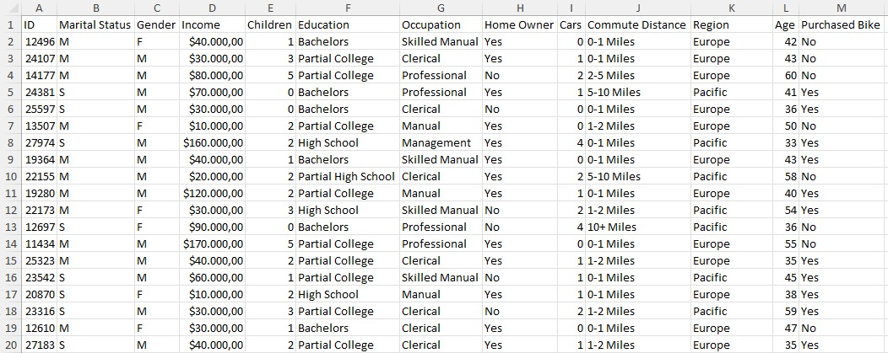
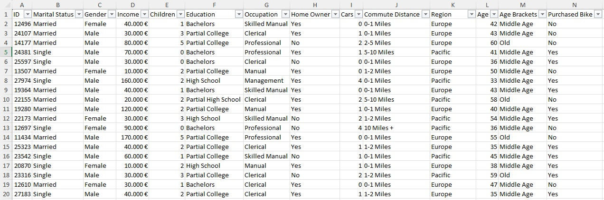
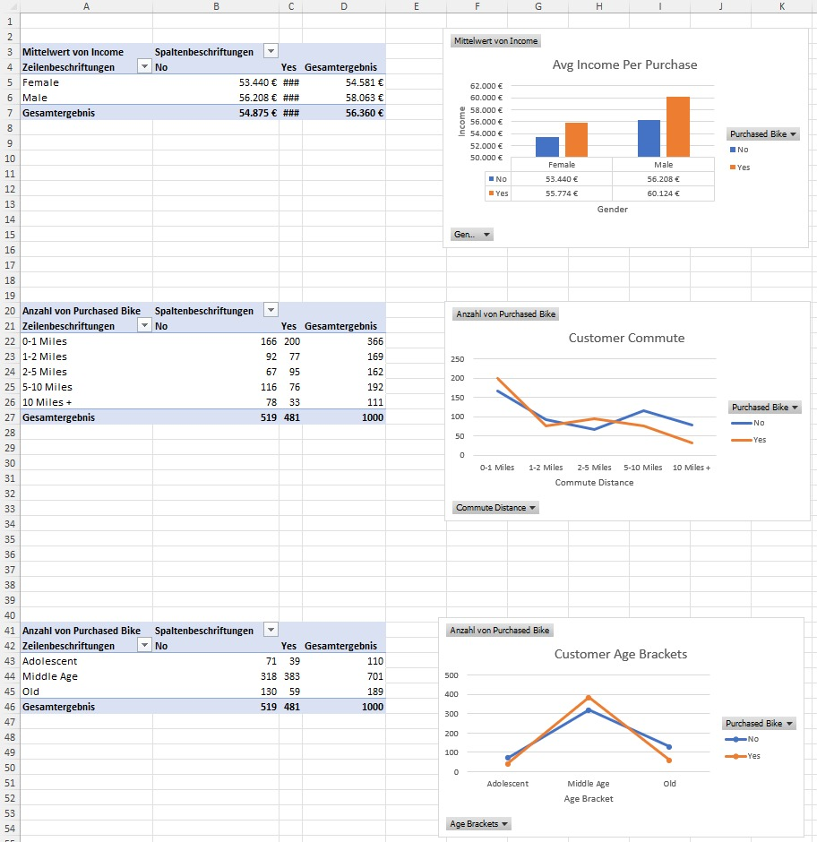
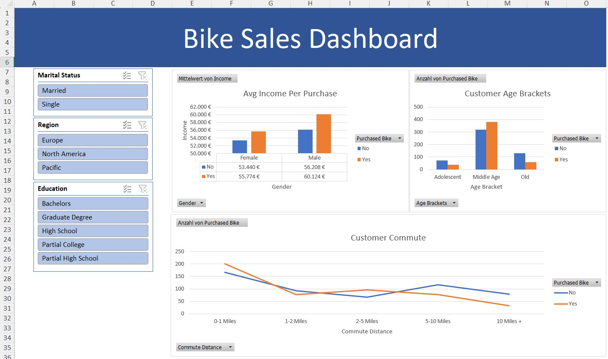

# Data Science Portfolio
## PyTorch Deep Learning
Contains my own materials including my exercise solutions of Daniel Bourke's [Learn PyTorch for Deep Learning: Zero to Mastery course](https://github.com/mrdbourke/pytorch-deep-learning)

| Chapter  | Exercises | Topics |
| ------------- | ------------- | ------------- |
| [00 - PyTorch Fundamentals](Pytorch_projects/00_pytorch_fundamentals.md) | [00 - Exercise](Pytorch_projects/00_pytorch_fundamentals_exercises.md) | Tensors, NumPy, Pandas, Reproducibility, GPU Runtime
| [01 - PyTorch Workflow](Pytorch_projects/01_pytorch_workflow.md) | [01 - Exercise](Pytorch_projects/01_pytorch_workflow_exercises.md) | Creating Sample Data, Building Models, Training, Predictions, Evaluating, Saving, Loading
| [02 - PyTorch Classification](Pytorch_projects/02_pytorch_classification.md) | [02 - Exercise](Pytorch_projects/02_pytorch_classification_exercises.md) | Binary Classification, Classification Models, Training, Inference, Improvements, Non-Linearity, Multi-Class Classification
| [03 - PyTorch Computer Vision](Pytorch_projects/03_pytorch_computer_vision.md) | [03 - Exercise](Pytorch_projects/03_pytorch_computer_vision_exercises.md) | CV Libraries and Data, Convolutional Neural Networks (CNNs), Comparing, Evaluating, Confusion Matrix
| [04 - PyTorch Custom Datasets](Pytorch_projects/04_pytorch_custom_datasets.md) | [04 - Exercise](Pytorch_projects/04_pytorch_custom_datasets_exercises.md) | Data Preparation, Data Transformations, ImageFolder Dataset, Custom Dataset, Data Augmentation, TinyVGG, Exploring Loss Curves, Predicting on Custom Images

## SQL Data Cleaning & Data Exploration / Analysis
The first SQL project handles cleaning up .csv data. The dataset is from [AlexTheAnalyst](https://github.com/AlexTheAnalyst).

Topics: Removing Duplicates, Standardization, Populating Null Values or Blank Values, Removing Unnecessary Columns.

The Code can be seen [here](SQL_projects/Data_Cleaning.md).

The cleaned data looks like this:

The second SQL project is about exploring the cleaned up data with some useful queries.

The Code can be seen [here](SQL_projects/Exploratory_Data_Analysis.md).

## Excel Data Cleaning & Dashboard Creation
The dataset is also from [AlexTheAnalyst](https://github.com/AlexTheAnalyst).

1. Raw data:
   

2. Cleaned data:
   

3. Created Pivot Tables and some Visualizations:
   

4. An Interactive Dashboard created with the Visualizations from before.
   
