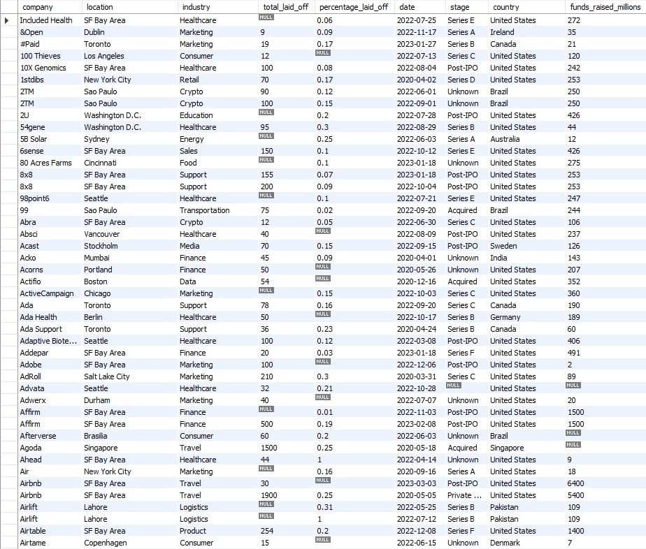

# Data Science Portfolio
## PyTorch Deep Learning
Contains my own materials including my exercise solutions of Daniel Bourke's [Learn PyTorch for Deep Learning: Zero to Mastery course](https://github.com/mrdbourke/pytorch-deep-learning)

| Chapter  | Exercises | Topics |
| ------------- | ------------- | ------------- |
| [00 - PyTorch Fundamentals](markdowns/00_pytorch_fundamentals.md) | [00 - Exercise](markdowns/00_pytorch_fundamentals_exercises.md) | Tensors, NumPy, Pandas, Reproducibility, GPU Runtime
| [01 - PyTorch Workflow](markdowns/01_pytorch_workflow.md) | [01 - Exercise](markdowns/01_pytorch_workflow_exercises.md) | Creating Sample Data, Building Models, Training, Predictions, Evaluating, Saving, Loading
| [02 - PyTorch Classification](markdowns/02_pytorch_classification.md) | [02 - Exercise](markdowns/02_pytorch_classification_exercises.md) | Binary Classification, Classification Models, Training, Inference, Improvements, Non-Linearity, Multi-Class Classification
| [03 - PyTorch Computer Vision](markdowns/03_pytorch_computer_vision.md) | [03 - Exercise](markdowns/03_pytorch_computer_vision_exercises.md) | CV Libraries and Data, Convolutional Neural Networks (CNNs), Comparing, Evaluating, Confusion Matrix
| [04 - PyTorch Custom Datasets](markdowns/04_pytorch_custom_datasets.md) | [04 - Exercise](markdowns/04_pytorch_custom_datasets_exercises.md) | Data Preparation, Data Transformations, ImageFolder Dataset, Custom Dataset, Data Augmentation, TinyVGG, Exploring Loss Curves, Predicting on Custom Images

## SQL Data Cleaning
The first SQL project handles cleaning up .csv data. The dataset is from [AlexTheAnalyst](https://github.com/AlexTheAnalyst).
Topics: Removing Duplicates, Standardization, Populating Null Values or Blank Values, Removing Unnecessary Columns.
The Code can be seen [here](SQL_projects/Data_Cleaning.sql).
The cleaned data looks like this:

